# CES展会的经验分享

---
- [CES展会的经验分享](#ces展会的经验分享)
  - [技术分享](#技术分享)
    - [3D产品展示](#3d产品展示)
    - [lottie-web](#lottie-web)
    - [移动端适配](#移动端适配)
    - [3d循环动画](#3d循环动画)
    - [imagemagick 脚本工具](#imagemagick-脚本工具)
  - [其他公司的CES展会](#其他公司的ces展会)
    - [小结](#小结)
  - [总结](#总结)

---
https://www.tp-link.com/en/exhibition/ces/virtual-exhibition/
## 技术分享
- 使用CommonArticle进行通用板块Header的管理（定义`header-`开头的commonArticle将可以通过`?headerType=header-xxx`的参数形式进行全局引入）
- 使用FilterBy的模块进行快速的产品列表页面建立

### 3D产品展示
- 在第一阶段时候考虑使用的是第三方的使用最广泛的3d模型框架：`three.js`(https://threejs.org/)
  - 需要设计师导出gltf格式的模型文件进行查看，线上查看方式：https://gltf-viewer.donmccurdy.com/
  - 然而由于设计师导出的模型十分卡顿，因此该方案弃用；
  - 改为使用水平的静态图片旋转方案；
    - 该灵感从[three.js推荐](https://threejs.org/docs/index.html#manual/en/introduction/Loading-3D-models)的模型网站[Sketchfab](https://sketchfab.com/3d-models?features=downloadable&sort_by=-likeCount)在不支持webgl相关API浏览器下的兼容效果中得到


- 关于3d水平旋转的逻辑，已封装到ces静态资源中的script-util.js的两个函数下，逻辑简短，可以直接调整复用
  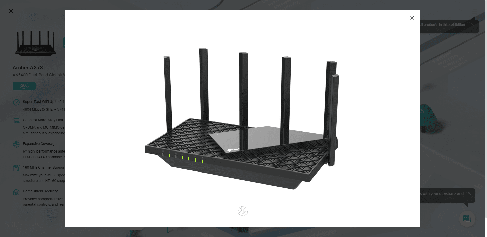

整体流程步骤：
  - 通过将设计师提供的多个产品图按照角度顺序进行水平拼接
    - （设计师提供的图片已带有序号）
    - 使用imagemagick 脚本进行图像的批量裁剪拼接(设计师导出部分产品的分辨率和实际使用不一致)，统一为1200x768
  - 绑定鼠标点击移动事件，记录相应偏移量，计算得到应该显示第几张图片，按照容器大小设置`translateX()`
    ```js
    /**
     * to add the 3d product dialog 
     * @param {string} product lowercase product model for image path
     */
    CESUtil.show3d = function(product) {
      var $3dDialog = $('<div class="tp-dialog ces-dialog-3d"><div class="tp-dialog-box tp-loading"><div class="tp-dialog-close"></div><div class="ui-3d-container"></div></div></div>');
      var handler3d = CESUtil.handler3d($3dDialog.find('.ui-3d-container'))
      handler3d.active()
      $3dDialog.on('click', '.tp-dialog-close', function() {
        $3dDialog.remove()
        handler3d.unactive()
      })
      $('body').append($3dDialog)
    }
    CESUtil.handler3d = function($3dContainer) {
      var ui3dActive = false
      var startPositionX, lastPositionX
      var lastImageIndex = 0
      var OFFSETDURING = 25
      function getPageX(ev) {
        if (ev.pageX) return ev.pageX
        if (ev.originalEvent && ev.originalEvent.targetTouches.length > 0) {
          return ev.originalEvent.targetTouches[0].pageX
        }
        return 0
      }
      function findFinalImageIndex(imageIndex, offset) {
        var result = (imageIndex + Math.floor(-offset/OFFSETDURING)) % 16
        if (result < 0) result += 16
        return result
      }
      var cancelHandler = function(ev) {
        ui3dActive = false
        lastImageIndex = findFinalImageIndex(lastImageIndex, lastPositionX - startPositionX)
      }
      return {
        active: function() {
          $('body').on('mouseup touchend', cancelHandler)
          $3dContainer.on('mousedown touchstart', function(ev) {
            ev.preventDefault();
            ev.stopPropagation && ev.stopPropagation();
            ui3dActive = true
            startPositionX = getPageX(ev)
          }).on('mouseleave', cancelHandler)
          $3dContainer.on('mousemove touchmove', function (ev) {
            if (ui3dActive) {
              ev.preventDefault();
              ev.stopPropagation && ev.stopPropagation();
              var cursorOffset = getPageX(ev) - startPositionX
              var currentImageIndex = findFinalImageIndex(lastImageIndex, cursorOffset)
              $(this).find('img').css({
                transform: 'translateX(' + -currentImageIndex*$(this).width() + 'px)'
              })
            }
            lastPositionX = getPageX(ev)
          })
        },
        unactive: function() {
          $('body').off('mouseup touchend', cancelHandler)
        }
      }
    }

    ```
    进行调用的时候仅需要按照实际需求调整图片的路径，调用`show3d()`方法即可。

### lottie-web
http://airbnb.io/lottie/#/
Lottie第三方插件工具，进行AE(需要bodymovin插件)平面动画的导出

  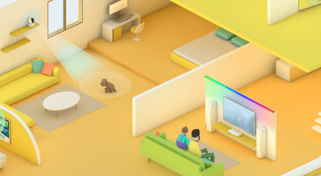
  - 优点：
    - 不必考虑动画实现细节，直接调用引入即可
    - 动画和设计师设计的实现一致，设计师也可以通过AE插件输出demo，直接预览web效果
    - 学习成本低，学习成本基本与swiper一样，提供API，支持设置播放、暂停、循环、速度设置等
    - 兼容性好，支持到IE9
  - 缺点：
    - 无法实现复杂的3d动画效果
    - 由于设计师缺少经验，部分动效在IE下可能会失效，需要与设计师积极对接，排查问题，换用其他动画效果实现
      - 目前遇到的问题，主要让设计师将复杂效果转化为静态png图后就能正常导出
  - 由于CES展会的lottie应用场景相对复杂，没有较大的通用价值，因此不列出，但相应源码在`script-util.js`文件已经做了封装，有兴趣的同事可以进行查看。
  - 基本调用方法如下：
    ```js
    var animation = bodymovin.loadAnimation({
      container: document.getElementById('lottie'), // Required
      path: 'data.json', // Required
      renderer: 'svg/canvas/html', // Required
      loop: true, // Optional
      autoplay: true, // Optional
      name: "Hello World", // Name for future reference. Optional.
    })
    ``` 
    对于各个参数选项的功能，可以更多参考官方的github仓库的Wiki内容：https://github.com/airbnb/lottie-web/wiki/loadAnimation-options


### 移动端适配

  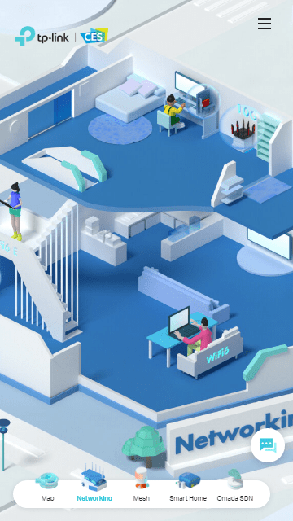
  - 与pc使用一套的宽高逻辑，通过对比window的宽高比和展馆的实际宽高比，将展馆填充满视口
  ```js
    (function() {
      var cesDom = document.getElementById('ces-hall');
      var cesCW, cesCH;

      function isViewLong() {
        var cesW = cesDom.offsetWidth;
        var cesH = cesDom.offsetHeight;
        var cesW2H = cesW / cesH;
        var windowW2H = window.innerWidth / window.innerHeight;
        return windowW2H > cesW2H
      }

      function resizeHandler() {
        if (isViewLong()) {
          cesCW = window.innerWidth
          cesCH = window.innerWidth * 1020 / 1920
        } else {
          cesCW = window.innerHeight * 1920 / 1020
          cesCH = window.innerHeight
        }
        cesDom.style.width = cesCW + 'px';
        cesDom.style.height = cesCH + 'px';
      }
      resizeHandler()
      window.addEventListener('resize', resizeHandler)
    }());
  ```
  - 定位元素采用百分比定位
  - 其他如字体大小与原来一样采用媒体查询进行设置
  

### 3d循环动画
  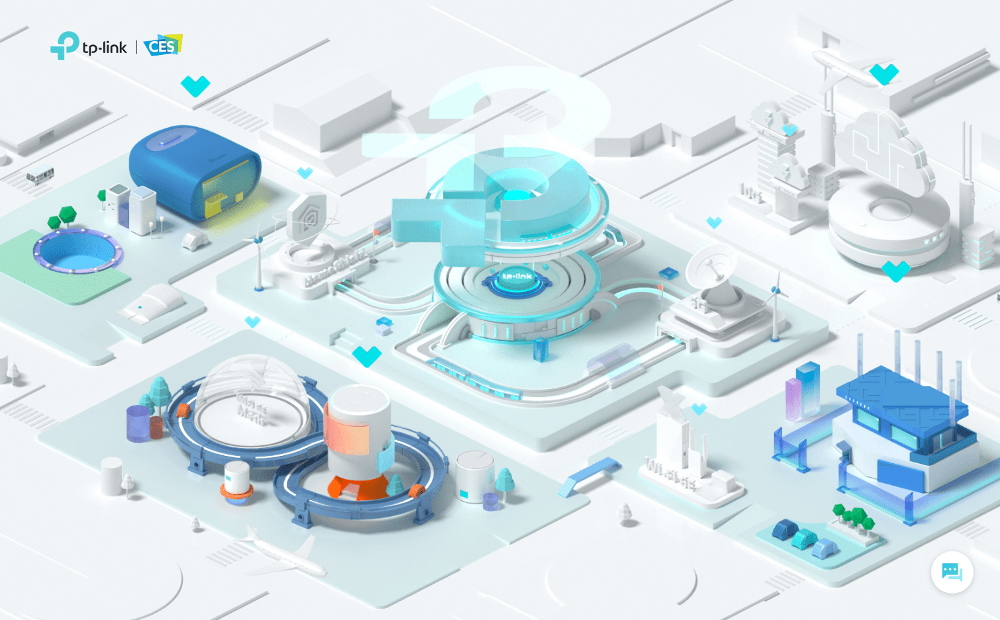
  - 为了让移动端也能正常实现预期效果，不能简单采用视频方案（手机端的视频为了节省流量有些默认无法自动播放）

  - 采用canvas进行png动画序列帧的渲染
    - 不采用雪碧图
      - 多个雪碧图切换中间会出现短暂的闪动
      - 全部整合单张，像素值过高无法保证浏览器能够正确解析，无法正确获得加载进度
      - 由于动画是1920x1020，生成雪碧图尺寸较大，也会影响加载解析渲染的速度
    - 不采用img或者div+background进行大量dom元素节点(`一帧一个图片HTML节点`)顺序遍历的切换显示
      - 在部分浏览器下会不稳定的出现闪动的问题(FireFox, IE)
  - 该部分代码同样已经封装，重点逻辑有两点
    - 进行png序列帧图片的获取
      - 重点在于需要进行控制并发请求数量的控制，避免阻塞页面其他资源的请求
      - 通过预先设置的帧数值，知道请求的终止条件
      - 同时可以配合渲染函数在每次修改对象的属性值时候更新进度条进度
    - 进行png序列帧的渲染
      - 重点在于通过帧数计算，控制渲染的频率
      - 设置动画的暂停和继续API，需要记录当前播放到那一帧
    ```js
    /**
     * # ajax get animation png
     * @param {object} options 
     * @example 
     * options = {
     *  maxRequestSameTime: 5,
     *  maxErrorTime: 3,
     *  CESINFOItem: CESINFO.mainhall,
     *  animationItem: {}
     * }
     */
    CESUtil.getLoopImages = function(options) {
      /**
       * Limit the requests in 4 at the same time, and check if there is error
       * If there are more than 3 times request error at one image, the page will alert the message to notice user.
       */
      var MaxRequestSameTime = options.maxRequestSameTime || 5, MaxErrorTime = options.maxErrorTime || 3;
      var CESINFOItem = options.CESINFOItem
      var animationItem = options.animationItem || (CESINFOItem && CESINFOItem.loopPNGAnimation[0])
      if (animationItem.readyAnimation > 0) return;
      var loadedImages = new Array(animationItem.totalFrames);
      var errorAnimations = new Array(animationItem.totalFrames);
      var i = 0;
      while (i < MaxRequestSameTime) {
        // using function to keep the correct `i`
        // keep 4 requests at the same time
        function getImageWithIndex(index) {
          loadedImages[index] = 1
          var tmpImg = new Image()
          tmpImg.src = animationItem.findPNGPath(index)
          $(tmpImg).on('load', function() {
            animationItem.loopImgs[index] = tmpImg
            var nextPngIndex = -1
            animationItem.addReadyPNG()
            for (var j = 0; j < animationItem.totalFrames; j++) {
              if (loadedImages[j] !== 1) {
                nextPngIndex = j
                break;
              }
            }
            if (nextPngIndex >= 0) getImageWithIndex(nextPngIndex)
          }).on('error', function() {
            errorAnimations[index] = errorAnimations[index] ? errorAnimations[index] + 1 : 1;
            if (errorAnimations[index] < MaxErrorTime) {
              getImageWithIndex(index)
            } else {
              console.log('Error. Please refresh the page and try again.')
            }
          })
        }
        getImageWithIndex(i++)
      }
    }
    /**
     * # set the play and stop handler for each pngsequence animation in a hall. 
     *  Play the png animation, when all the pngs for animation is ready.
     * @param {object} options 
     * @return {object}
     * @example
     * options = {
     *  CESINFOItem: CESINFO.mainhall
     * }
     * // returns {play: function() {}, stop: function() {}}
     */
    CESUtil.setLoopPNGAnimation = function (options) {
      return (function() {
        var CESINFOItem = options.CESINFOItem
        CESINFOItem.loopPNGAnimation && $.each(CESINFOItem.loopPNGAnimation, function(index, item) {
          var animateStarted = false; // avoid loop animation start multi times
          var loopAnimateHandler, lastStopedFrame;
          var fps = item.fps || 40;
          var canvas = item.canvas;
          if (item.zIndex) $(canvas).css('z-index', item.zIndex);
          item.play = function() {
            if (animateStarted) return
            animateStarted = true
            var framesEachSecond = fps;
            var timeStampDelta = 1000 / framesEachSecond;
            var ctx = canvas.getContext('2d');
            var lastTimeStamp
            var lastImgFrame = lastStopedFrame || 0
            function play(timestamp) {
              if (lastTimeStamp === undefined) {
                lastTimeStamp = timestamp
              }
              var now = Date.now()
              if (now - lastTimeStamp >= timeStampDelta) {
                lastTimeStamp = now
                if (++lastImgFrame >= item.totalFrames) {
                  lastImgFrame = 0;
                }
                ctx.clearRect( 0, 0, ctx.canvas.width, ctx.canvas.height );
                var currentImg = item.loopImgs[lastImgFrame]
                ctx.drawImage(currentImg, 0, 0)
                lastStopedFrame = lastImgFrame
              }
              loopAnimateHandler = requestAnimationFrame(play)
            }
            loopAnimateHandler = requestAnimationFrame(play)
          };
          item.stop = function() {
            animateStarted = false
            cancelAnimationFrame(loopAnimateHandler)
          }
        })
      }());
    }
    ```
    首先通过`getLoopImages`进行图片的异步获取,同时为了不阻塞页面其他资源的加载，需要设置最大并发请求数的限制，该函数的参数配置参考如下：
    ```js
    options = {
      maxRequestSameTime: 5,
      maxErrorTime: 3,
      CESINFOItem: CESINFO.mainhall, // 与下方setLoopPNGAnimation函数参数中提到的的CESINFOItem为同个对象
      animationItem: {} // 为单个的需要进行动画序列帧获取的动画对象(为下方setLoopPNGAnimation中loopPNGAnimation数组的单个元素)
    }
    ```

    提供`setLoopPNGAnimation`参数配置参考如下(由于代码本身较少，可以进行重新调整)：
    ```js
      options = {
        CESINFOItem: {
          loopPNGAnimation: [
            {
                canvas: document.getElementById('canvas'), // required
                fps: 40,
                zIndex: 1,
                totalFrames: 48, // 一共多少张png图片，用于提前确定异步请求的终止条件
                loopImgs: { // 存放用于播放的图片资源对象
                  0: Image(),
                  1: Image(),
                  ...
                },
                play: function() {}, // 函数调用之后会自动生成的动画播放api
                stop: function() {}
            }
          ]
        }
      }
    ```
    函数完成处理之后，将为每个`loopPNGAnimation`下的Object设置`play`和`stop`方法，进行动画的控制

### imagemagick 脚本工具
https://imagemagick.org/index.php

支持的参数设置，也可以直接查看[官网文档](https://imagemagick.org/script/command-line-processing.php)

作为一个系统级的命令行工具，可以快速进行图片的拼接压缩转换等，配合php，js等脚本工具可以提前按照指定顺序拼接素材路径后运行，避免了每次命令都要手动重新输入的问题
  - 本次项目是借助npm下的`imagemagick`工具包编写的js脚本进行处理, 已经重新进行了封装并上传到svn库下：svn://ibsvn.ib.tp-link.net:8000/svns/project/FrontTool/imagemagick
  - 如果为了方便系统直接调用，也可以考虑编写对应的bat脚本，方便直接运行而不用其他环境
    - 3d产品图的尺寸裁剪 + 设置白色背景 + 拼接
      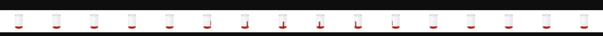
      ```
      magick convert -monitor -limit memory 2GiB -limit map 4GiB -define registry:temporary-path=./tmp {...item} -resize 1200x768 -background white -gravity center -extent 1200x768 +append -strip ./output/out.jpg
      ```
      - `-monitor -limit memory 2GiB -limit map 4GiB -define registry:temporary-path=./tmp` 为了避免脚本消耗太多内存资源，规定超出处理范围的其他内容通过硬盘中转处理(可以省略)
      - `{...item}` 所有要进行拼接的图片路径，用空格隔开
      - `-resize 1200x768` 设置输出文件宽高
      - `-background white` 设置白色背景(因为是jpg)
      - `-gravity center` 设置裁剪时候的产品中心
      - `-extent 1200x768` 设置裁剪时候原始图案进行缩放的大小(否则会按照原始大小截取图案部分区域，不会等比例缩放)
      - `+append` 横向拼接
      - `-strip` 去除版权等信息
    - icon图标的雪碧图裁剪 + 保持透明度拼接
      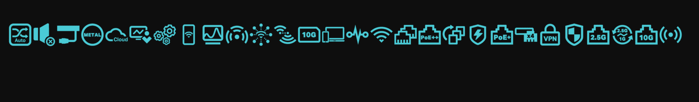
      与3d产品图的拼接基本一致，仅仅在图像大小和背景方面设置不同
      ```
      magick convert -monitor -limit memory 2GiB -limit map 4GiB -define registry:temporary-path=./tmp {...item} -resize 68x68 -background transparent -gravity center -extent 68x68 +append -strip ./output/out.png
      ```
    - 部分产品图片的尺寸批量裁剪
      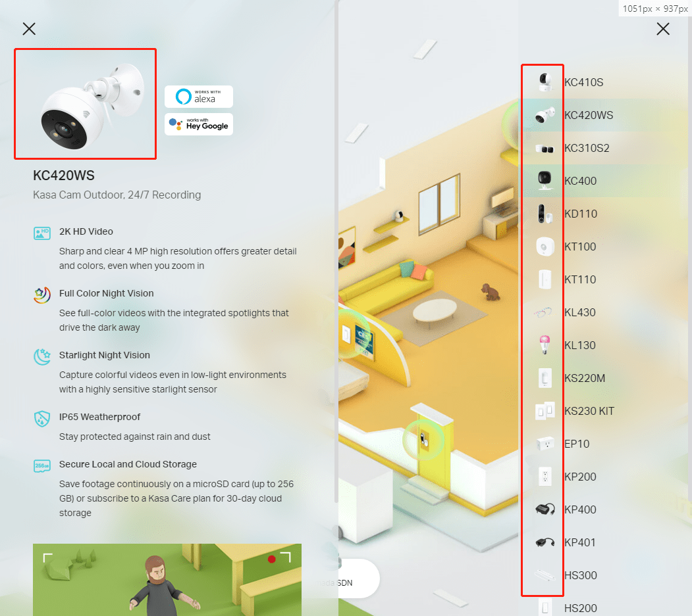
      仅仅在icon图标的操作中重新设置尺寸，然后去除拼接操作即可，另外要注意配合nodejs提前读取目录下的所有产品图片进行遍历处理
      
      ```
      magick convert ./origin/{productModel}.png -resize 360x360 -background transparent -gravity center -extent 360x360 -strip ./output/{productModel}.png
      ```

    - 通用的png压缩为jpg
      - `-interlace Plane` => 渐进式图片
      - `-quality 85%` => 压缩质量
      ```
      magick convert "origin/bg.png" -interlace Plane -quality 85% "./output/bg.jpg"
      ```
    - png压缩为png在我按照文档进行操作时候没有出现任何体积压缩，这里就不列出了，仅需要注意导出时候设置background 透明，如下：
      - `-strip` 去除版权信息
      - `-background transparent` 设置背景透明
      ```
      magick convert "origin/bg.png" -background transparent -strip "./output/bg.png"
      ```


## 其他公司的CES展会
- HP惠普

  采用静态页面的方式进行呈现

  https://www8.hp.com/us/en/ces.html
  

- AMD

  采用很短的跳转banner + 2020年内容回顾

  https://www.amd.com/zh-hans/events/ces
  

- asus华硕

  采用倒计时的banner, 配合facebook的AR相机还有日历功能

  https://www.asus.com/event/ces/
  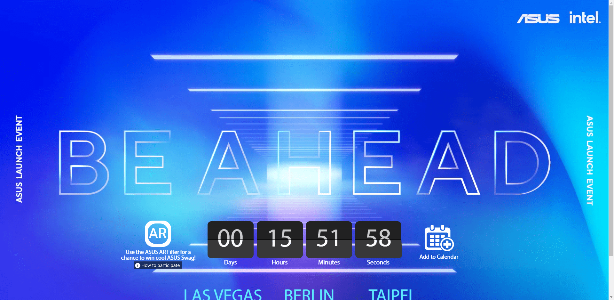

- dell ces2020

  (暂未发现ces2021相关页面)采用静态页面的方式：
  https://www.dell.com/en-us/cp/ces-dell-product-awards
  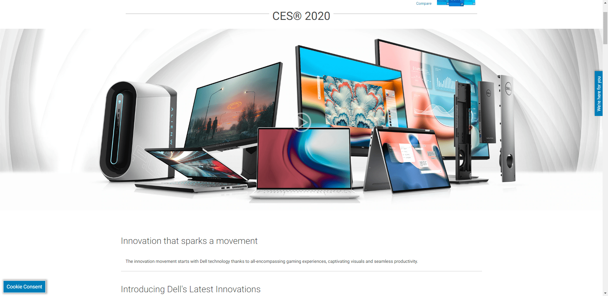

- netgear

  静态页面方式 + 视频板块 + 线上商场
  https://www.netgear.com/events/ces2021
  
  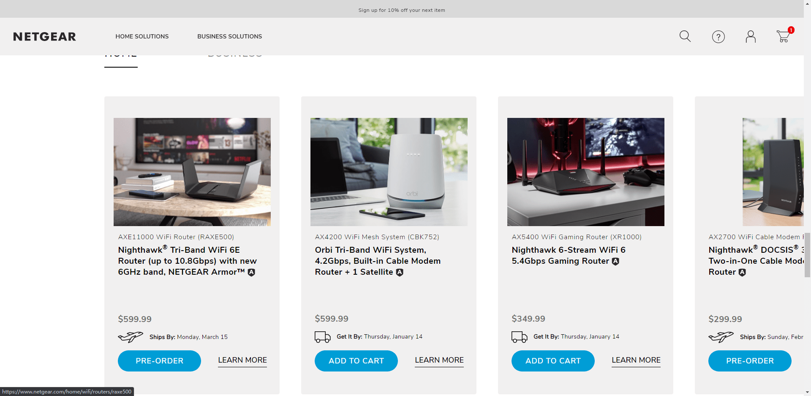

- dlink
  
  静态页面 + 系列CES主题页面 + 虚拟展馆 + 视频板块
  https://www.dlink.com/en/events/ces-2021
  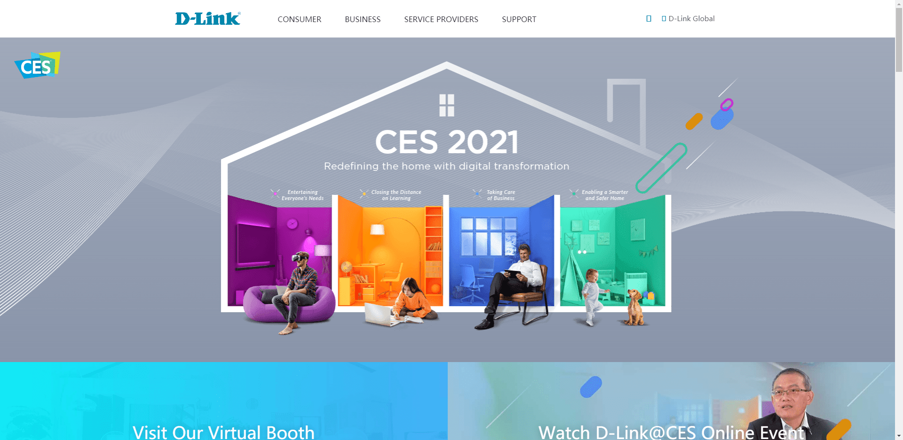
  - 虚拟展馆使用[iStaging](https://www.istaging.com/)第三方平台
  - 视频板块针对各个知识点均有板块
    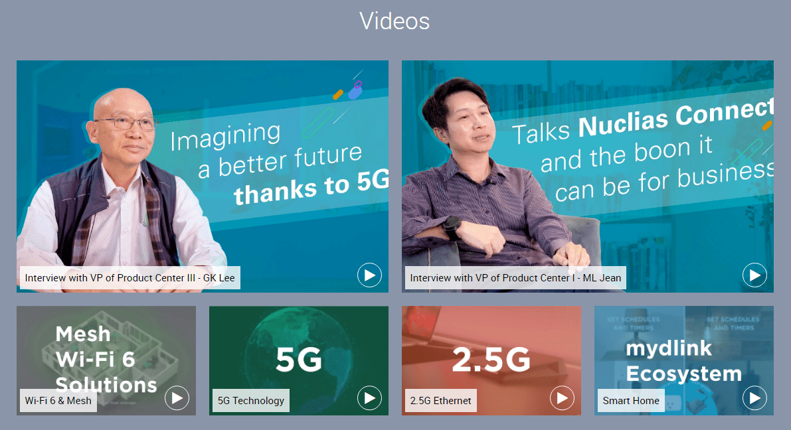

- LG

  静态页面 + 直播Youtube + 虚拟展馆 + 主题Studio
  （有明显的主题LifeisXX）
  https://www.lg.com/global/exhibition/index.html#section=a
  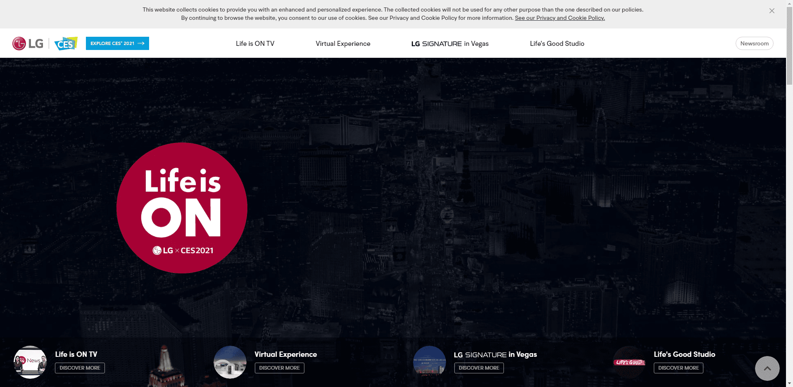

### 小结
- 在进行页面策划实现的时候，可以更有主题指向性(参考LG - LifeisXX)
- 在展会开始前，可以考虑添加日历、倒计时等方式让用户日期预定（作为邮箱订阅的替代、补充方案）
- 考虑添加视频、直播形式(如果有余裕)
- 考虑添加相关产品的预定、购买链接，推进营销
- 展馆如果工期紧张，可以考虑使用第三方的展馆平台

## 总结
- 对于各个新技术的使用，很多时候是从其他网站得到的灵感，这里推荐chrome的插件`Wappalyzer`，可以查看其他网站使用的主要技术。
  - 像这一次在CES展会项目初期，设计师那边提供一个网站参考：https://www.borraginol.com/town/shop/，使用了GSAP + pixiJS进行页面的渲染.
  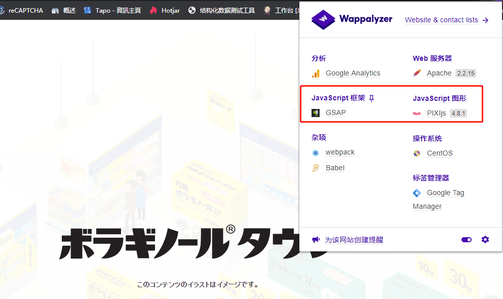
    - 但是去network查看页面请求的各类资源时候发现页面也使用了很多类似骨架动画的文件，这方面对我们本次项目的参考意义就不大了，这次展会中设计师提供的稿件下主要是3d下的动画较多，没有涉及骨架动画等。
    - 然后对GSAP和pixiJS各自进行了调研
      - 发现GSAP是基础的动画支持库，相对来讲更偏向底层实现，对于加快项目进度来说帮助不大
      - 而pixiJS更多的是对平面动画的渲染，比如一些canvas的游戏，但是这在我们这次项目中也没有达到必须使用的地步，使用pixiJS也意味着canvas下的许多动画渲染依旧需要由前端进行处理。
    - 后面想到此前一直有兴趣的lottie，便把这个列入了本次使用的技术栈。这个也把复杂的平面动画效果的设计实现完全交付给设计师，前端仅需要进行调用添加其他交互逻辑即可，极大地减少前端方面的工作量。
- 而此前lottie的知晓，则是以前在一些技术公众号的分享中得知，而后一直有所印象，主要是各个互联网厂的技术部分的一些公众号，比如`阿里技术`, `滴滴技术`, `腾讯技术工程`等，一般搜索对应公司 + `技术`就能搜到