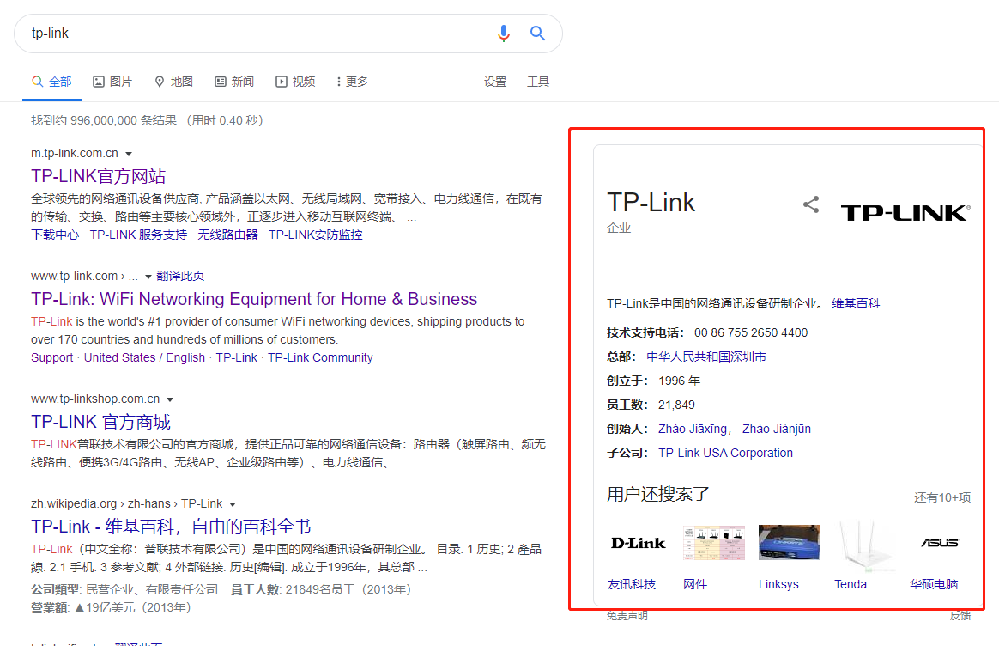
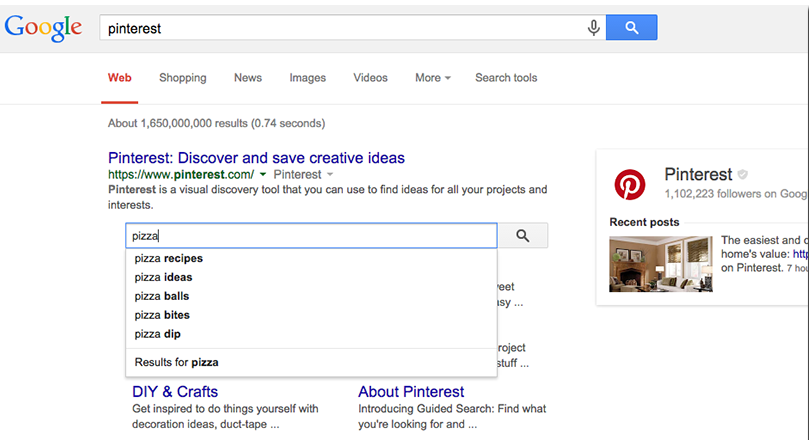
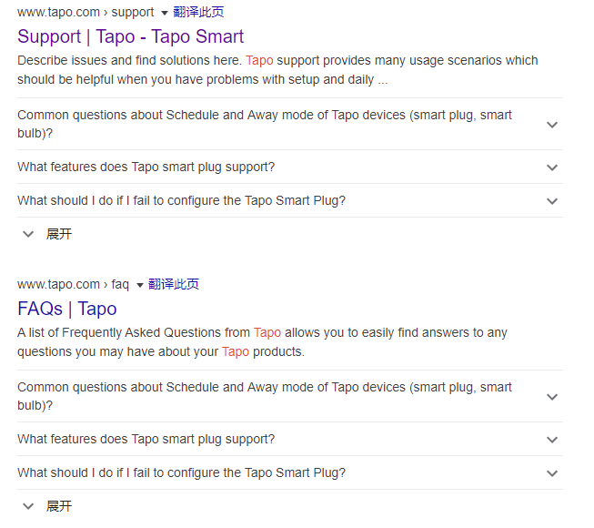
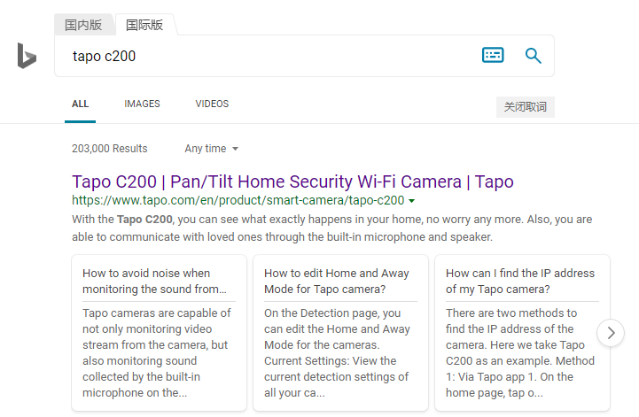
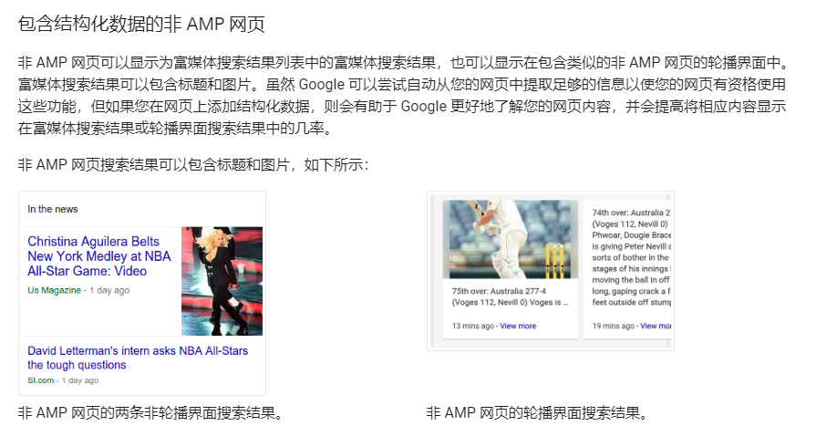
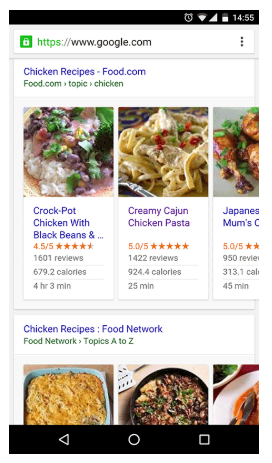

Tapo官网的结构化数据添加效果总结
===

- [Organization](#organization)

- [WebSite](#website)

- [FAQPage](#faqpage)

- [NewsArticle](#newsarticle)

- [ItemList](#itemlist)

----

该报告用于列出在Tapo官网中添加的结构化数据，并说明各类结构化数据的作用

#谷歌支持支持的结构化数据对应的显示方式，可以参考如下链接：
https://developers.google.com/search/docs/guides/search-gallery

#可以尝试使用google自带的结构化标记工作，`google search console > 旧版工具和报告 > 网站工具集 > 测试工具 > 结构化数据标记辅助工具`

#结构化相关工具参考[官方给出的调试方式](https://developers.google.com/search/docs/guides/debug)

----

## [Organization](https://developers.google.com/search/docs/data-types/logo)

`徽标`，即品牌商家信息

- **添加页面**: 所有页面 ([部分说法](https://www.searchenginejournal.com/google-do-not-put-organization-schema-markup-on-every-page/289981/)推荐仅添加首页)

- **添加方式**
```html
<script type="application/ld+json">
{
	"@context": "http://schema.org",
	"@id": "https://www.apple.com/#organization",
	"@type": "Organization",
	"name": "Tapo",
	"url": "https://www.tapo.com/",
	"logo": "https://www.tapo.com/res/images/og-img.jpg"
}
</script>
```
- **预期效果**
  
	在用户搜索tapo的时候，在右侧显示出tapo的品牌信息
	
- **结果**
  
	没有实现理想效果，经过[调研](https://developers.google.com/search/docs/guides/enhance-site)，发现需要[到google中添加商家](https://www.google.com/business/)，待确认

## [WebSite](https://developers.google.com/search/docs/data-types/sitelinks-searchbox)

`网页`，在google搜索引擎中没有相关定制化样式，这里的添加目的在于让页面的搜索结果能够显示搜索框，具体参考[官方说明](https://developers.google.com/search/docs/data-types/sitelinks-searchbox)

- **添加页面**: 所有页面

- **添加方式**
```html
<!-- 其中的${site.siteUrl }是jstl语法，为tapo子站点链接 -->
<script type="application/ld+json">    
{
  "@context": "https://schema.org",
  "@type": "WebSite",
  "url": "https://www.tapo.com/",
  "potentialAction": {
    "@type": "SearchAction",
    "target": "${site.siteUrl }search/?q={search_term_string}",
    "query-input": "required name=search_term_string"
  }
}
</script>
```

- **预期效果**

	在搜索结果页面出现搜索框
	

- **结果**

	没有生成理想效果，经过[调研](https://support.google.com/webmasters/thread/8731118?hl=en)
	> The sitelink search doesn't automatically show, (it only tends to pop up for popular sites, and even then normally only for branded searches.)
	
	因此只有

## [FAQPage](https://developers.google.com/search/docs/data-types/faqpage)
`常见问题解答`，显示问答列表。
- **添加页面**: support、faqs、产品详情页面、单个FAQ页面
- **添加方式**
	```html
	<!-- 以下为jstl语法 -->
	<ul class="popular-answers-list" itemscope itemtype="https://schema.org/FAQPage">
		<c:forEach items="${popularAnswers }" var="answer">
			<li itemscope itemprop="mainEntity" itemtype="https://schema.org/Question">
				<a href="${rootUrl}faq/${answer.articleId }/" target="_blank"><span itemprop="name">${answer.title }</span></a>
				<div class="hidden" itemscope itemprop="acceptedAnswer" itemtype="https://schema.org/Answer">
						<div itemprop="text">${answer.articleContent }</div>
					</div>
			</li>
		</c:forEach>
	</ul>
	```

- **结果**

	- Support的结果效果良好，在`Support | Tapo`和`FAQs | Tapo`页面能够直接显示各类信息
	
	- 但是在产品详情页面以及FAQ的单篇文章页面没有效果，应该是google自身引擎算法识别后撤销了效果，因为在bing下的产品详情结果中有对应样式
		
		

		参考：https://developers.google.com/search/docs/guides/sd-policies
		```
		重要提示：Google 不保证您的结构化数据一定会显示在搜索结果中，即使结构化数据测试工具显示您的网页已正确地添加了标记也是如此。常见原因如下：

		使用结构化数据会启用相关功能，但并不保证一定会显示该功能。Google 算法会根据多种可变因素（包括搜索记录、所在位置和设备类型）来确定要显示的搜索结果，以便按照自己的标准为用户打造最佳的搜索体验。在某些情况下，该算法可能会判定某项功能比另一项功能更合适，甚至会判定普通的蓝色链接最合适。
		结构化数据未体现网页的主要内容，或可能具有误导性。
		结构化数据不正确，但测试工具未能发现该错误。
		用户看不到结构化数据引用的内容。
		网页不符合本文所述的结构化数据指南、针对特定类型的指南或通用的网站站长指南。
		要查看更多常见结构化数据错误，请点击此处。
		```
	
## [NewsArticle](https://developers.google.com/search/docs/data-types/article)
`新闻文章`

- **添加页面**: 单篇news页面

- **添加方式**
  ```html
	<!-- 以下为jstl语法 -->
	<div class="article-wrapper tapo-content" itemtype="https://schema.org/NewsArticle" itemscope>
		<meta itemprop="url" content="${s.siteUrl }news/${article.articleId}/"/>
		<div class="hidden">
			<div itemprop="publisher author" itemtype="https://schema.org/Organization" itemscope>
				<meta itemprop="name" content="Tapo"/>
				<meta itemprop="url" content="https://www.tapo.com/"/>
				<div itemprop="logo" itemtype="https://schema.org/ImageObject" itemscope>
					<meta itemprop="url" content="https://www.tapo.com/res/images/og-img.jpg"/>
					<meta itemprop="height" content="630"/>
					<meta itemprop="width" content="1200"/>
				</div>
			</div>
		</div>
		<meta itemprop="mainEntityOfPage" content="${s.siteUrl }news/${article.articleId}/"/>
		<meta itemprop="image" content="${article.articleImageUrl}"/>
		
		<div class="hidden" itemprop="datePublished">
			<fmt:formatDate pattern="yyyy-MM-dd'T'HH:mm:ssz" value="${article.articlePublishDate}" />
		</div>
		<div class="hidden" itemprop="dateModified">
			<fmt:formatDate pattern="yyyy-MM-dd'T'HH:mm:ssz" value="${article.lastUpdateDate}" />
		</div>
		<div class="article-header">
			<h1 class="article-title medium" itemprop="headline">${article.title }</h1>
			<div class="article-info regular clearfix">
				<c:if test="${not empty suitableforModelNo }">
				<span class="model-no">${suitableforModelNo }</span>
				</c:if>
				<div class="info">
					<span class="faq-updated">
						<fmt:formatDate pattern="MM-dd-yyyy" value="${article.articlePublishDate}" />
					</span>
					<span class="faq-pageview">
						<fmt:formatNumber type="number" value="${article.hits }" />
					</span>
				</div>
			</div>
		</div>
		<div class="article-content">
		${article.articleContent }
		</div>
	</div>
	```

- **预期效果**

	显示文章标题与图片
	

- **结果**
  
	没有出现任何富媒体样式，根据谷歌的[质量指南](https://developers.google.com/search/docs/guides/sd-policies)的`内容`一栏
	```
	提供最新信息。对于具有时效性的内容，一旦它们无法再反映最新情况，我们便不会将其显示为富媒体搜索结果。
	```
	考虑到tapo网站目前发布的news都较久远，有可能因此而无法正常显示。


## [ItemList](https://developers.google.com/search/docs/data-types/carousel)

`轮播视图`

- **添加页面**: 产品列表页面

- **添加方式**
  ```html
	<!-- 以下为jstl语法 -->
	<ul itemtype="https://schema.org/ItemList" itemscope class="product-list">
		<c:forEach items="${productList }" var="productItem" varStatus="itemStatus">
			<c:set var="itemId" value="${productType }-${itemStatus.index+1 }"/>
			<li itemprop="itemListElement" itemscope itemtype="https://schema.org/ListItem" class="product-item" id="${itemId }">
				<%--"${site.siteUrl }product${productItem.productTypeName }${productItem.modelNoForUrl }/" --%>
				<a itemprop="url" href="${site.siteUrl }product${productItem.productTypeName }${productItem.modelNoForUrl }/" aria-label="${productItem.modelNo }"><span class="hidden">${productItem.modelNo }</span></a>
				<div class="img"></div>
				<div class="text clearfix">
					<h3 class="title medium" itemprop="name">${productItem.productName }</h3>
					<div class="model" itemprop="description">${productItem.modelNo }</div>
					<div class="more">${more } <span class="more-arrow">&gt;&gt;</span></div>
				</div>
				<meta itemprop="position" content="${itemStatus.index+1 }">
			</li>
		</c:forEach>
	</ul>
	```

- **预期效果**

	实现移动端的轮播界面效果

	

- **结果**

	- 采用`摘要方式`添加的结构化，没有出现预期效果；
	- 在[文档](https://developers.google.com/search/docs/data-types/carousel)中找到这样的说法
		```
		目前，以下内容类型支持列表格式：食谱、课程、文章、餐厅、电影。

		如果是摘要页面，则 ListItem 应仅包含 type、position 和 url 属性。
		```
	- 因此考虑是在产品中没有添加`食谱、课程、文章、餐厅、电影`类型的结构化数据导致无法形成富媒体样式;
