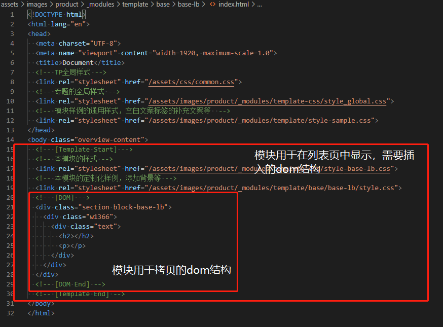

# 专题模板化

## 【课题目标】
- 解决当前板块样式dom结构的复用问题
- 提供可视化的一个板块选择界面，实现快速dom+css结构拷贝
- 目前的方案为了解决上期课题中专题模板与脚手架耦合在一起的问题，模板的添加逻辑从脚手架中解耦出来，采用单个文件夹+单个通用样式一键复制的逻辑直接添加模板样式。

## 【项目地址】
https://internal-test.tp-link.com/assets/images/product/_modules/

## 【模板添加逻辑】
- 如果要新增模板，只需要参考现有模板建立新的文件即可。

  - 每个html文件有两个css样式文件
    - `style-template.css`，给外部调用，提供一键复制的css
      - 是除去了图片等可定制化部分的通用的css
    - `style.css`，用于列表显示的自定义模板css
      - 是在基础的模板样式以外，为了在模板列表中能够有相应背景图片等可视化元素添加的定制化css
    - 目前已有的板块带有styl源码，后续新增专题板块的时候该部分不是必须的内容

## 【页面逻辑】
- 目前逻辑：
  - 在列表页面`index.php`中直接使用php获取模板项目的目录结构转化为js变量
    
  - 根据目录结构进行dom结构构建
  - 异步get请求`模板存放目录`各个文件夹下html文件并解析
    
  - 根据注释范围`<!-- [Template Start] -->`获取要显示的dom结构(包含css)
  - 根据注释范围`<!-- [DOM] -->`获取要拷贝的DOM结构插入前端隐藏的textarea（用于一键复制）
  - 异步get请求`模板通用样式`文件夹的各个css并填充到隐藏的textarea（用于一键复制）
  - 绑定事件，点击对应按钮进行对应textarea内容的copy
  - 每个插入模板，都插入一个iframe用于显示移动端样式
  - 绑定对应跳转链接，由于单个模板都采用html的方式进行定义，因此都能够实现直接单页面访问

## 【额外内容】

  - 新增`_widgets`模块，用于存放非banner级别的小组件样式
  - 页面新增`icons`板块，通过php读取`/assets/images/icon`目录下的图标，用来查看可以使用的图标，提供路径的一键复制
    
  
