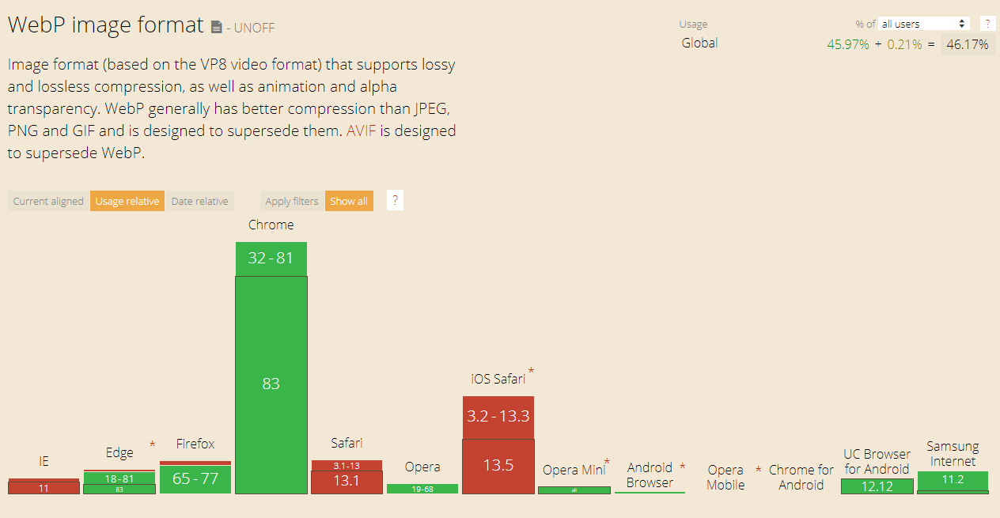
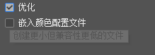

图片的压缩处理方案
---
<style>span[red]{color:red;}</style>
---
摘要：

由于此前设计师反馈部分专题图片模糊的问题，针对后续专题的图片处理，根据调研的结果给出一些建议

---
目录:
- [图片处理情形](#图片处理情形)
  - [常规banner图片](#常规banner图片)
  - [图片的背景是纯色的](#图片的背景是纯色的)
  - [图片的背景是非纯色的](#图片的背景是非纯色的)
- [第三方图片压缩工具](#第三方图片压缩工具)
- [图片处理方式](#图片处理方式)
- [可能遇到的问题](#可能遇到的问题)
- [图片压缩建议](#图片压缩建议)
  - [个人猜想的接入webp的方案](#个人猜想的接入webp的方案)
    - [前端](#前端)
    - [后端](#后端)
- [动效图片的处理方式](#动效图片的处理方式)
  - [基本特性](#基本特性)
  - [Gif使用情形](#gif使用情形)
  - [MP4使用情形](#mp4使用情形)
  - [素材处理方式](#素材处理方式)
- [【关于`存储为Web所用格式（旧版）`中的jpg优化选项】](#关于存储为web所用格式旧版中的jpg优化选项)
  - [【优化选项总结】](#优化选项总结)
  - [参考链接](#参考链接)
- [专题图片压缩方案对比](#专题图片压缩方案对比)
  - [【说明】](#说明)
  - [【研究使用样例】](#研究使用样例)
  - [【图片裁剪操作】](#图片裁剪操作)
  - [【压缩前】](#压缩前)
    - [PC端稿件：](#pc端稿件)
    - [移动端稿件：](#移动端稿件)
  - [【压缩结果】](#压缩结果)
    - [compress网站：直接使用默认参数进行压缩，无重点区域遮罩](#compress网站直接使用默认参数进行压缩无重点区域遮罩)
    - [tinypng批量处理](#tinypng批量处理)
    - [使用PS的web格式导出-品质60：（效果相对直接使用compress网站进行压缩要更加清晰一些）](#使用ps的web格式导出-品质60效果相对直接使用compress网站进行压缩要更加清晰一些)
  - [【效果测试地址】](#效果测试地址)
  - [【设计师意见】](#设计师意见)
- [关于文档](#关于文档)
  - [版本历史](#版本历史)
  - [评审历史](#评审历史)

---


# 图片处理情形
为了保证图片显示的质量，针对不同情形下的图片处理做了具体区分。
以下样例图片来自[TX401](https://www.tp-link.com/en/home-networking/pci-adapter/tx401/v1/preview/?vervison=624655)与[Archer C54](https://www.tp-link.com/en/home-networking/wifi-router/archer-c54/v1/preview/)以及[Archer AX90](https://www.tp-link.com/en/home-networking/wifi-router/archer-ax90/)专题
## 常规banner图片
- 可以直接`导出为Web所用格式`，导出为jpg，保证产品部分清晰不模糊的前提下降低图片品质，压缩体积
   
## 图片的背景是纯色的
- <span red>在不影响图片观感的前提下，可以带着背景纯色作为jpg导出，图片体积将比png格式小很多，默认品质70


## 图片的背景是非纯色的
- 如果`可以分离图层`
  - 将带有细节的前景图片导出为`png`
  - 背景图片：
    - 如果明显被其他文案或者图片遮挡且自身有一定模糊的，这一类的细节不需要保留，直接导出为`jpg`后统一用tinypng进行压缩（一般作为背景）
      
    - 如果没有被其他内容遮挡，会作为页面的主要部分被看到，则`导出为Web所用格式`，导出为jpg图片，设置`品质`来得到图片和体积都较好的图片
      
- 如果`不可以分离图层`
  
  这一般是由于设计稿件内部分图层加了特殊效果，分层后单独导出会出现异常
  - 图层混合截取图片后，直接`导出为Web所用格式`，导出为jpg图片，通过设置`品质`来得到图片和体积都较好的图片；

# 第三方图片压缩工具
- 不要使用第三方工具导出带有灰度值的渐进式jpg图片(compress等压缩工具带有的渐进式压缩选项)，会在一开始的时候出现黑白图片，感官上很恐怖
  - 这是因为压缩工具(`默认渐进`)可能采用了和photoshop(`半渐进`)不一样的`扫描脚本方式`, 参考[文章](https://cloudinary.com/blog/progressive_jpegs_and_green_martians#how_to_get_the_best_of_both_worlds)
  - PhotoShop导出的渐进式图片则没有该问题，按需使用

- 为了图片质量，不应该使用Jpg再次导出jpg(参考adobe中的[说明](https://helpx.adobe.com/photoshop-elements/using/optimizing-images-jpeg-format.html))
  - (无需保证质量的一些背景图片除外)
  > Note:
  > 
  > Artifacts, such as wavelike patterns or blocky areas of banding, are created each time you save an image in JPEG format. **Therefore, you should always save JPEG files from the original image, not from a previously saved JPEG.**

# 图片处理方式
- jpg图片（无需透明背景的）
  - 如果有诸如渐进之类的特殊需要
    - `ctrl+alt+shift+s`唤出`保存为web所用格式`界面，按需通过ps直接导出保存
  - 如果图片质量不需要保证：(非重点图片、移动端图片)
    1. 在ps导出品质为100的图片
    2. 通过tinypng进行压缩
  - 如果图片质量需要保证：（banner图片, 产品大图）
    1. 用`保存为web所用格式`限定图片品质获取理想图片
       - 图片体积不超过200K

- png图片（带有产品`细节`、带有`渐变`颜色的）
  - `ctrl+alt+shift+w`,在ps导出png24的图片(默认配置)
  - 通过tinypng进行压缩

# 可能遇到的问题
- 勾选了`连续`(也就是渐进式图片)之后导出的文件大小有10+M，远大于预览的图片大小
  - 是软件bug，可以尝试复制图层之后新建一个新的标签粘贴进去后再导出

- 发现图片体积过大
  - 可以在配置界面右上角输入期望的图片体积让ps自动设置jpg导出的品质
    
    


# 图片压缩建议
在腾讯的[图片压缩的演进](https://cloud.tencent.com/developer/article/1150960)中,也有通过使用Webp来实现图片流量的降低；避不开对于不同客户端的区别处理；

考虑到目前的webp浏览器支持覆盖面已经比较广泛，为了降低流量成本，可以考虑采用webp图片格式配合部分浏览器的兼容进行实现：

## 个人猜想的接入webp的方案
### 前端
- 图片生成方案：
  - 利用脚手架工具自动将图片转化为Webp图片，减少额外图片转化工作
- 图片引入方案：
  - 通过js判断浏览器是否支持webp再做兼容处理，参考[google文档](https://developers.google.com/speed/webp/faq#how_can_i_detect_browser_support_for_webp)

### 后端
- 图片生成方案：
  - 利用脚本转换服务器上的图片为webp图片
- 图片引入方案:
  - 通过统一的接口处理图片请求，对于请求webp图片的判断header的accept type，进行兼容，不支持webp则返回png、jpg
- 第三方Negix服务，PageSpeed，参考[博客](https://aotu.io/notes/2016/06/23/explore-something-of-webp/index.html)

建议通过后端修改批量生成改动，配合批量改动style.css内的图片链接到webp图片

---
# 动效图片的处理方式
目前主要的动效文件的处理方式有GIF和MP4，现在主要在二者间考虑更优的解决方案；
## 基本特性
- GIF：
> 图像互换格式（GIF，Graphics Interchange Format）是一种位图图形文件格式，以8位色（即256种颜色）重现真彩色的图像。它实际上是一种压缩文档，采用LZW压缩算法进行编码，有效地减少了图像文件在网络上传输的时间。它是目前万维网广泛应用的网络传输图像格式之一。
> - 优秀的压缩算法使其在一定程度上保证图像质量的同时将体积变得很小。
> - 可插入多帧，从而实现动画效果。 
> - 可设置透明色以产生对象浮现于背景之上的效果。
> - 由于采用了8位压缩，最多只能处理256种颜色，故不宜应用于真彩色图片。
- MP4:
> MPEG-4 Part 14或MP4是一种数字 多媒体 容器格式，最常用于存储视频和音频，但也可以用于存储其他数据，例如字幕和静止图像。[2] 与大多数现代容器格式一样，它允许通过Internet 流式传输。MPEG-4 Part 14文件的唯一官方文件扩展名是.mp4。MPEG-4第14部分（正式为ISO / IEC 14496-14：2003）是被指定为MPEG-4一部分的标准。

MP4只是一种媒体容器，因此决定其文件体积的在于视频使用的编码方式以及对应的码率设置

## Gif使用情形
- 对于一些分辨率较小、动画帧数整体较少、颜色要求不高、背景需要透明的动画，可以使用GIF图片
- 可以方便的直接作为图片引入

## MP4使用情形
- 对于一些分辨率较大，动画流畅度要求高的，使用MP4的媒体资源引入
- 使用html5标签`<video>`配合css设置宽高引入
  ```html
  <video src="/assets/images/product/archer-ax90_v1/img/video-mesh.mp4" autoplay loop muted controls playsinline></video>
  ```
  - autoplay: 自动播放(部分移动端浏览器为了节省流量会无效)
  - loop: 循环播放
  - muted: 静音(在ios下，只有静音的视频autoplay才会生效)
  - controls: 显示视频在浏览器下的基本控制组件(播放、暂停按钮等)
  - playsinline: 行内播放，不会点击后全屏播放(iphone默认点击后全屏播放)

## 素材处理方式
- 如果设计师提供了gif文件，说明gif下的颜色是设计师可以接受，可以直接使用在线转换工具(例如[EZGif](https://ezgif.com/gif-to-mp4))转化为mp4
- 如果提供了mp4文件过大，考虑[在线工具](https://www.mp4compress.com/)压缩视频（需要注意一些在线工具可能会给视频加上水印）
  - 根据压缩比例清晰度会下降
  - 如果压缩后的视频清晰度无法接受，可以考虑让设计师导出视频时候降低码率（视频的体积是由比特率(/码率)决定的）

---

# 【关于`存储为Web所用格式（旧版）`中的jpg优化选项】

关于[优化选项说明](https://helpx.adobe.com/cn/animate/using/save-for-web-options.html#JPEG%E4%BC%98%E5%8C%96%E9%80%89%E9%A1%B9)

- `连续` - 以多条路径下载
 
  对应着渐进式图像，也就是显示从模糊到清晰的图片，会有兼容性问题（不过主流都支持了，可以参考[wiki](https://en.wikipedia.org/wiki/Comparison_of_browser_engines_(graphics_support)#JPEG_support)）

  
  
 
  > 渐进
  > 
  > 在 Web 浏览器中以渐进方式显示图像。图像将显示为一系列叠加图形，从而使浏览者能够在图像完全下载前查看它的低分辨率版本。“渐进”选项要求使用优化后的 JPEG 格式。


- `优化` - 创建更小但兼容性更低的文件
  
  *该选项在勾选`连续`的时候无法使用*

  

  > 优化后
  >
  > 创建文件大小稍小的增强 JPEG。要最大限度地压缩文件，建议使用优化的 JPEG 格式；但是，某些旧版浏览器不支持此功能。

  https://zhuanlan.zhihu.com/p/28926408 :
  > 选择使用优化的huffman编码格式，这个可达到优化图片色彩质量的效果，生成的文件较小，但有的图象软件不接受这种格式文件。

- `嵌入颜色文件` - 包含基于Photoshop颜色补偿的ICC配置文件

  

  > 嵌入颜色配置文件 (Photoshop) 或 ICC 配置文件 (Illustrator)
  >
  > 在优化文件中保存颜色配置文件。某些浏览器使用颜色配置文件进行颜色校正。

  https://zhuanlan.zhihu.com/p/28926408 :
  > ICC配置文件：此项默认是选择的，它的作用是保证色彩在不同应用程序，不同电脑平台，不同图像设备之间传递的一致性。

## 【优化选项总结】

- `渐进`
  - 效果可以查看附件中的[./img/jpg-progressive.mp4](./img/jpg-progressive.mp4)
  - 在加载部分图片内容的时候就能够全部显示出来了
  - 由于在默认的导出中没有该选项，可以按需使用（因为有时候图片没有加载完会让用户觉得网站图片很模糊）

- `优化`
  - 以品质60的图片为例 (181.7K -> 159.1K)
    - 不勾选`优化` - 181.7K

      
      
    - 勾选`优化` - 159.1K

      
  - 该选项在默认配置中都进行了勾选，如果图片没有`渐进式`读取的需求，建议都使用，经过测试在目前的chrome\firefox\ie都可以正常浏览访问

- `嵌入颜色文件`
  - 以品质60的优化图片为例(159.1K -> 159.7K)
    - 不勾选时候 - 159.1K
      
      
    - 勾选时候 - 159.7K

      
  - 该配置选项的成本不高，可以保证颜色的一致性，建议勾选
    > ICC配置文件：此项默认是选择的，作用是保证色彩在不同应用程序，不同电脑平台，不同图像设备之间传递的一致性。

---

## 参考链接
  
关于[图形格式的存储说明](https://helpx.adobe.com/cn/photoshop/using/saving-files-graphics-formats.html)

关于[配置界面的说明](https://helpx.adobe.com/cn/photoshop-elements/using/optimizing-images.html)

关于[优化选项说明](https://helpx.adobe.com/cn/animate/using/save-for-web-options.html#JPEG%E4%BC%98%E5%8C%96%E9%80%89%E9%A1%B9)

关于[优化选项操作](https://helpx.adobe.com/photoshop-elements/using/optimizing-images-jpeg-format.html )

关于[导出为...](https://helpx.adobe.com/cn/photoshop/using/export-artboards-layers.html)

关于[渐进式图片会有黑白层的问题](https://cloudinary.com/blog/progressive_jpegs_and_green_martians)

---
# 专题图片压缩方案对比

## 【说明】
- 对比使用compress网站(https://compress-or-die.com/jpg)压缩图片效果与ps直接导出图片效果的差异
- 在ps导出页面（存储为Web所用格式(旧版)）中发现效果较好
  - 体积相对较小的jpg参数如下图(品质为60) 
    
  - 由于ps的png导出选项的改动对于图片的体积没有较大帮助(调整了选项后(*这里不考虑png的8位图，因为失真太过严重*)，左侧预览的图片体积没有变化)，因此png图片仅列出compress|tinypng压缩结果
    

## 【研究使用样例】
- 专题`KC115_v1`
## 【图片裁剪操作】
打开设计稿，使用矩形选择框选中无文字的版块`ctrl+shift+c`拷贝后，`ctrl+n`新建画布，选中剪贴板的分辨率，`ctrl+v`将复制的板块粘贴到新画布中作为原始psd文件进行后续导出操作
* 这是考虑到相比逐个隐藏显示的效率，使用选择框的工作效率会明显高出很多，也不必去考虑可能溢出板块的内容

- <span red>ps下`ctrl+shift+c`截取的透明背景图片，在新建文档的时候分辨率可能与截取的面积不一致，可以：
  - 截取带有背景的整体图片并新建文档放入；
    1. 去掉背景后再次截取透明图层部分，粘贴到刚才新建的文档中进行对齐；
    2. 隐藏带有背景的整体图片和底部背景层；
    3. `ctrl+shift+alt+s`保存为png格式。
  - 或者使用切片：
    1. 快捷键`C`使用切片, 进行截取
    2. 在左侧长按切片工具，使用`切片选择工具`, 微调切片边缘
    3. `ctrl+shift+alt+s`，左上方选中切片模式
    4. 在左侧的预览界面内左键点击要导出的切片(`shift+点击`可以多选)，然后右侧设置导出参数
    5. 如果在导出时候不期望导出到文件夹内，可以在导出界面的右上角`编辑输出设置`<br>
       
       - 选中存储文件，取消勾选`将图像放入文件夹`，然后保存<br>
    6. 选择导出的目录的时候，注意下方选择导出`选中的切片`以及自定义保存的设置<br>
       

## 【压缩前】
按照专题规范要求使用`导出为...`中选择jpg格式品质为100，在该参数下导出的图片作为compress压缩前的原始图片大小
### PC端稿件：
- 9张jpg：6MB（721+529+620+397+453+981+981+775+691）
- 5张png：401KB（9.04+353+10.8+12.8+15.7）
### 移动端稿件：
- 9张jpg：2.15MB（254+98+461+293+318+167+230+151+229）
- 1张png：337KB


## 【压缩结果】

### compress网站：直接使用默认参数进行压缩，无重点区域遮罩
  - pc端：
    - 9张jpg：6MB -> **721KB**（65.1+70.1+66.1+38.3+75.9+103+125+88.2+87.7） 11.8326%
    - 5张png：401KB -> **167KB**（5.73+142+6.69+5.84+7.3） 41.6459%
  - 移动端:
    - 9张jpg：2.15MB -> **293KB**（24.2+16.4+52.9+32.6+57.3+20.9+33.2+21.9+34.1） 13.3085%
    - 1张png：337KB -> **139KB**  41.2463%
  
### tinypng批量处理
  - pc端：
    - 9张jpg：6MB -> **1.56M**(155+233+233+132+139+156+219+192+141) 26%
    - 5张png：401KB -> **137KB**(4.1+115+4.61+5.89+7.27) 34.1646%
  - 移动端：
    - 9张jpg：2.15MB -> **684KB**(62.6+53.6+152+84.8+91.5+38.4+54.2+81.9+65.1) 31.0683%
    - 1张png: 337KB -> **105KB** 31.1573%
  
### 使用PS的web格式导出-品质60：（效果相对直接使用compress网站进行压缩要更加清晰一些）
  - pc端：
    - 9张jpg：6MB -> **1.33M**（159+133+141+83.3+138+162(*品质50*)+191(*品质50*)+181+176）压缩率 22.1667%
  - 移动端：
    - 9张jpg：2.15MB -> **651KB**（57.4+98+111+65.2+102+44.4+65+43.2+64.6）压缩率 48.29157%
  

## 【效果测试地址】
- compress网站默认压缩：[pc: 889KB, 移动端: 433KB] 体积最小，效果最差
  - https://internal-test.tp-link.com/res/images/vi/kc115_v1/compress-default/
- ps品质60导出：[pc: 1.49MB, 移动端：709KB] 体积较小，效果较好
  - https://internal-test.tp-link.com/res/images/vi/kc115_v1/ps-out-60/
- tinypng网站压缩：[pc: 1.70MB, 移动端：752KB] 体积中等，效果中等
  - https://internal-test.tp-link.com/res/images/vi/kc115_v1/tinypng/

## 【设计师意见】
根据该专题的负责设计师反馈，使用`tinypng`压缩的图片质量能够被接受
> Hi Tobin,
>
> 看了一下, 第三种最清晰, 前面两个不能接受, 图片太模糊了
>
> - tinypng网站压缩：[pc: 1.70MB, 移动端：752KB]
>
>谢谢

---

---


---

# 关于文档
## 版本历史
|时间|撰写人|版本|备注|
|:--:|:--:|:--:|:--|
|2020.05.26|tobin.xu|V0.1|
|2020.07.27|tobin.xu|V1.0|将得到初步结论的数据步骤移入文档`专题图片压缩方案对比`；<br>添加不同情况下的图片处理方案；<br>添加关于gif与video的说明
|2020.08.11|tobin.xu|V1.1|将`专题图片压缩方案对比`放入文档末尾
|2020.08.26|tobin.xu|V1.2|按照建议，添加了切片导出png透明图片的具体说明
|2020.10.23|tobin.xu|V1.3|按照反馈，对于背景纯色的图片，也可以采用jpg的导出方式，将ps切片导出的步骤放到【图片裁剪操作】

## 评审历史
|时间|评审人|评审建议|
|:--:|:--:|:--|
|2020.07.06| 月例会 |继续探究800kb/200kb的标准是否还有下降空间，需要同时考虑开发效率和流量成本|
|2020.08.06| 月例会 |将`专题图片压缩方案对比`放入文档末尾