# 数据报表经验

如下是报表的整体构建逻辑，各个报表部分均有对应的解释逻辑和改动经验，一些相对有用的小经验，有专门用【】进行标注，可供后续报表建立提供参考：

关于维度创建时候可以使用的函数，在输入时候其实会有提示，也可以参考[官方的文档](https://support.google.com/datastudio/table/6379764?hl=en)

第一板块：整体数据情况
-----------

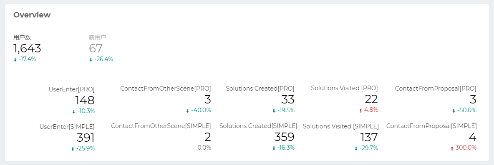

数据的Solutions Created代表在创建方案的对应按钮的唯一身份事件数，而Solutions Visited则是记录了用户最终生成的方案页面数量；

这两者出现数量上的差异，也就是用户点击了对应生成方案的按钮，但是最终的方案数量没有和点击的按钮次数一一对应：

-   主要是由于用户会存在回退的操作，在用户回退到*场景选择界面以外*的中间任意步骤页面，都会在原有方案的基础上进行*重新修改已有方案*而不是创建新方案；

【重要Tips】同时发现有时候在SolutionsVisited数据和GA获取到的不一致，而对应的filter过滤条件是一模一样的，我将数据通过表格展示之后，对比发现在没有添加指标的时候，数据会部分被减少，如下是Solutions Visited[PRO]对应的表格数据添加了指标之后的数据（左侧）和未添加指标的数据（右侧）；**只有在添加了指标之后的数据才会和GA保持一致；**

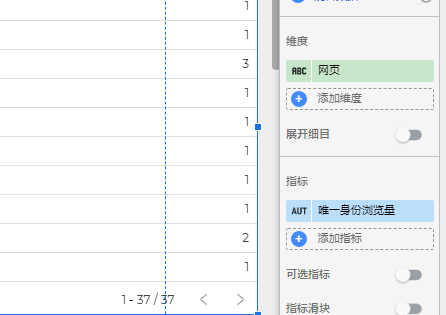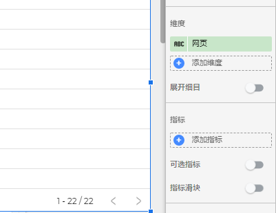

而目前第一个板块的数字部分，目前只有指标一个参数，无法添加额外维度等信息，因此这部分数据缺少真实性，暂时移除，该部分信息可以在第二页的solution唯一身份访问量来确认。

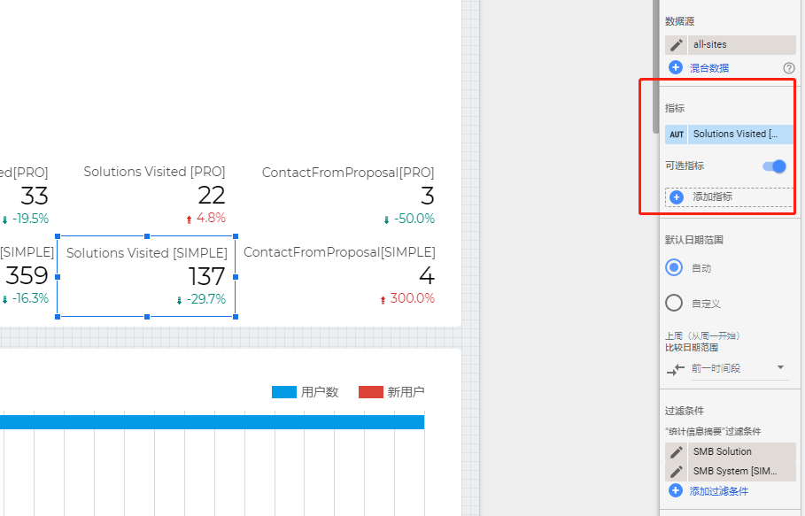

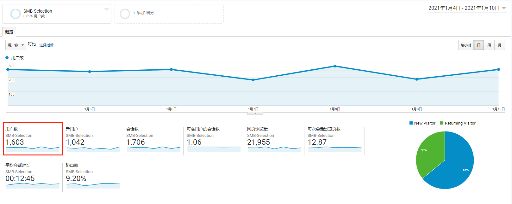

用户数和通过`细分`过滤出来的用户数数量基本一致，这两者出现细微差异的原因在于Google Data Studio和GA的`细分`对于过滤条件的实现不同：(从官网文档记录可以知道：<https://support.google.com/analytics/answer/7331978?hl=en> )

-   Google Data Studio是使用的过滤条件，是单纯从用户访问的网页来进行过滤；
-   而GA的`细分`过滤是针对用户的会话进行过滤，只要用户的会话链中访问过一次指定页面，就会被记录在内；

新用户数有较大的偏差，则是因为对于`**细分`获取到的内容会包括过滤页面以及+同个会话链上的其他页面+，导致其他页面的新用户也被记录在内**；

下方的各个数字则是各个对应事件的唯一身份点击数，通过过滤条件的叠加进行精确指定：

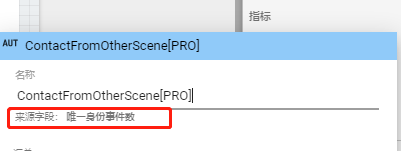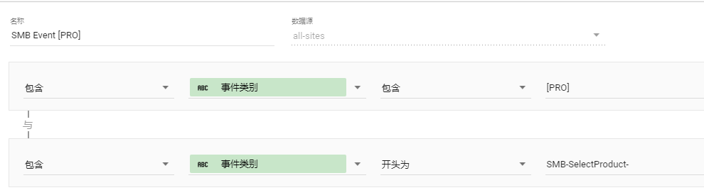

第二板块：各个地区对不同类型项目的访问情况
---------------------

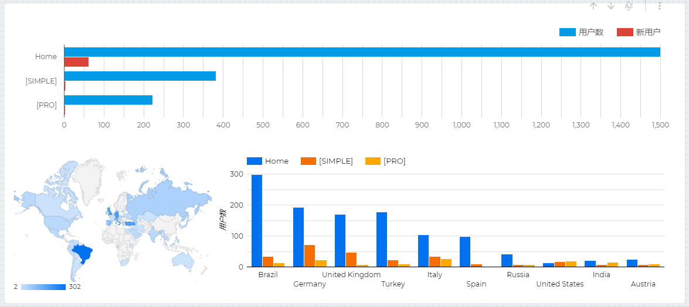

在整体的首页用户数量，快速选型和专业选型数量方面和GA数据基本一致：（这里是拿GA的唯一身份访问量来和报表的用户数做对比，有微小偏差）

首页：1566

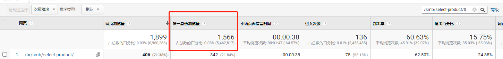

快速选型：397

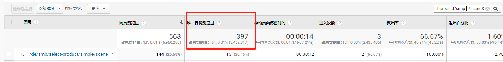  

专业选型：228

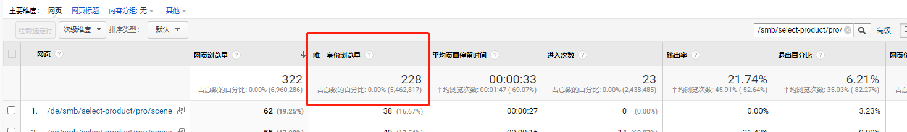

在国家地区方面和GA的数据趋势也是一致的：

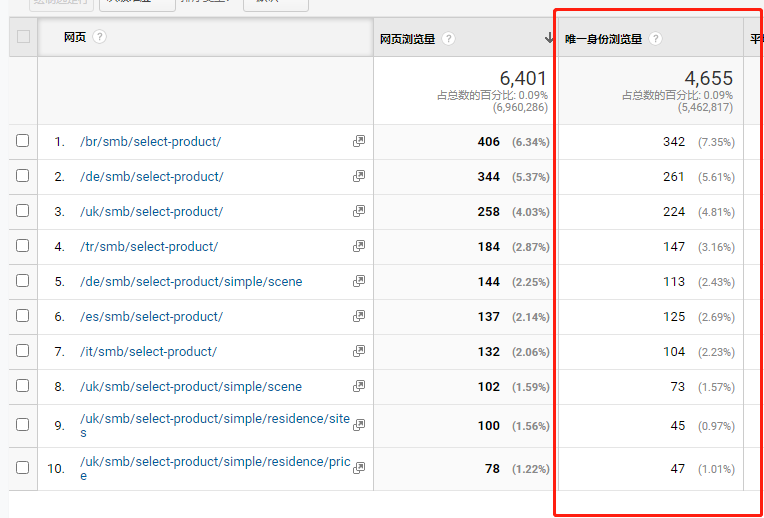

在报表的建立方面，使用不同的报表类型，将访问的用户数量根据访问的项目类型进行了汇总区分，排除了其他冗杂数据的干扰：

【**值得记录的小Tips**】  - 对于不想要显示的维度，可以在CASE的语句中返回NULL，同时配合过滤器，对该字段为NULL的内容进行排除，即可实现隐藏

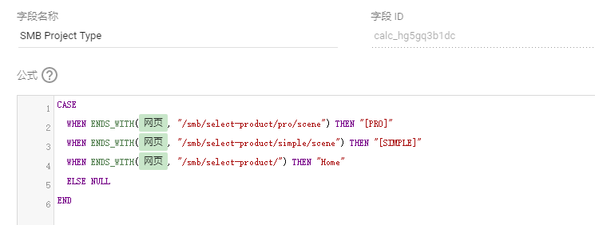

第三板块：用户场景点击情况
-------------

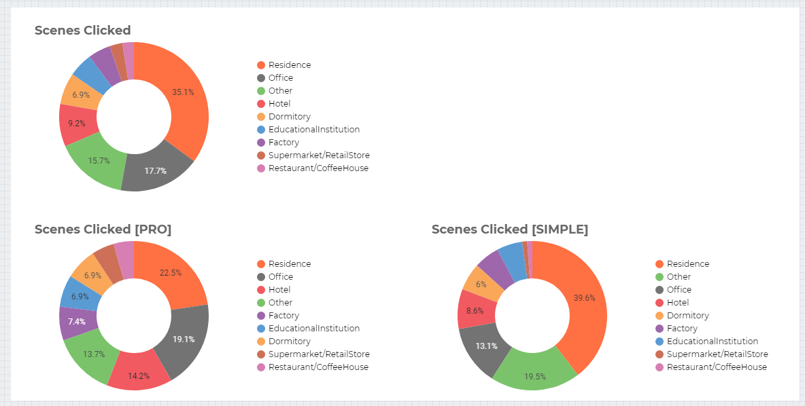

这个作为事件点击情况，具体点击次数和进入快速选型、专业选型的用户数量基本一致；

是对用户选择场景的唯一身份点击数的统计，在展示方面，由于事件都带有相同的前缀和后缀(项目类型[PRO]/[SIMPLE])，观测时候需要去除，因此对已有的事件名称进行重新整理：

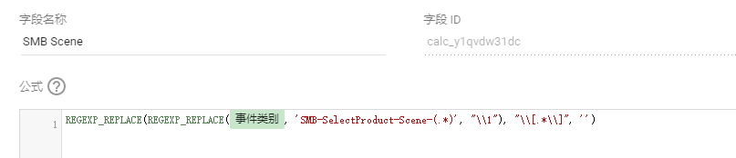

第四板块：用户价位点击情况
-------------

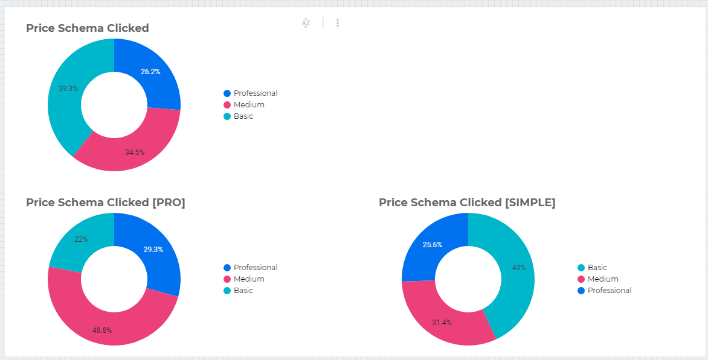

与第三板块所做的操作是一致的，进行事件的冗余字符串处理，然后进行报表显示

第五板块：用户感兴趣的产品、产品特性的事件统计
-----------------------

该部分比较简单，直接过滤对应事件，然后和第三、四板块相同，去除事件名中的重复部分即可

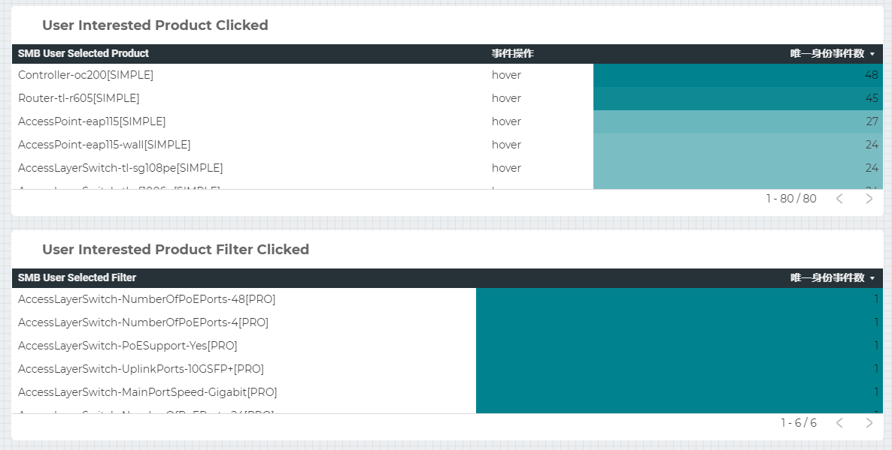

目前用户查看oc200的情况和tl-r605的情况较多

-   路由的话优先推荐TL-ER7206和TL-R605，而像br还没有上线TL-ER7206，因此会优先推荐TL-R605让用户看见
-   而controller方面
    -   一方面是像用户数量最多的巴西，没有上线OC300，因此在硬件方面会优先推荐oc200
    -   另一方面是和技术支持确认了对于Coming Soon的产品不会做推荐，而Omada Cloud Based Controller在所有站点均未上线，因此也没有出现CBC的产品。

第六板块：各个场景下的各个步骤间的用户流失情况
-----------------------

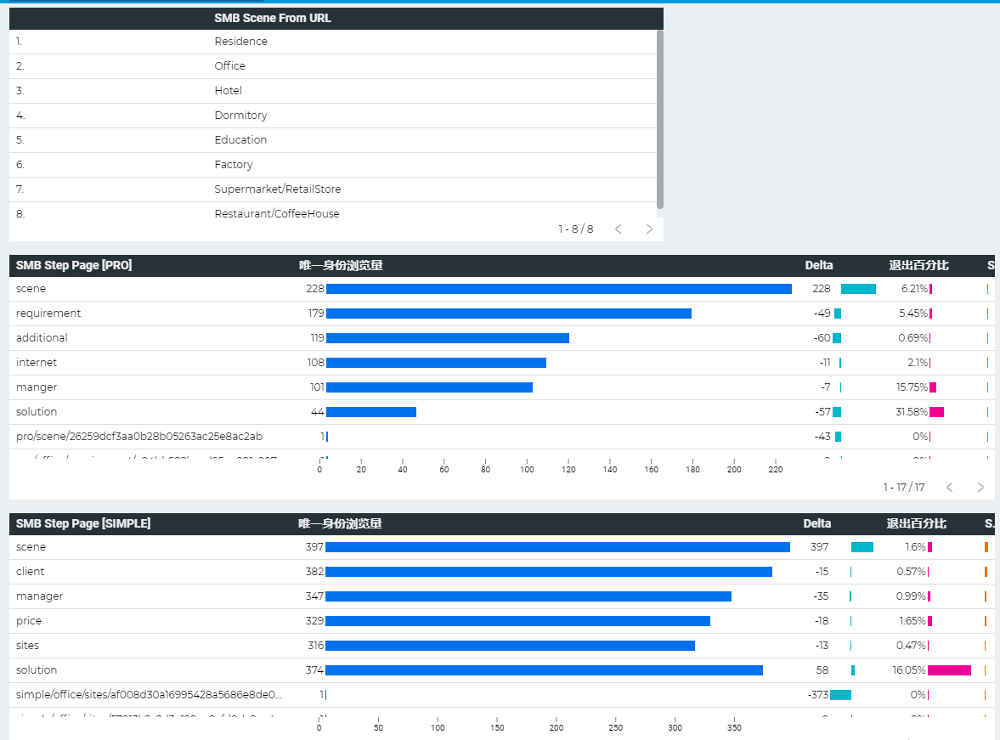

当前的数据在各个步骤下用户流失情况都和预期的一致，比较异常的是在快速选型系统下，solution的唯一身份访问量会比上一个步骤多，排查之后发现：

-   大约有6个方案页面是直接方案进入的(一个方案是一个单独url，会被记为不同的唯一身份浏览量)，会有部分用户是直接对已有方案进行访问；
-   同时也有部分用户是进行了回退到场景选择界面重新进行了方案生成，这时候前面的步骤由于url与原先一致，因此不会被重复记录，而方案页面由于带有不同的id，同个用户重新创建的方案会被重新记录（可以在表格中下滑，会看到有许多前面步骤带上了id值的url，这些都是由于用户在已经生成了方案的前提下再次回退到先前页面导致的）

另外发现这里的总体solution数量，

在第一个用于过滤的表格中，需要根据url划分用户访问的不同的场景：

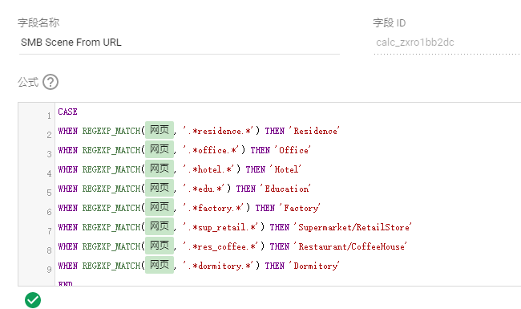

同时这里需要使用到表格的过滤器功能，能够将点击的部分对应的网页过滤出来应用到+该页面报表的其他表格(这也是为什么需要单独新开一个页面，可以避免过滤了第一页报表的其他数据)+中，实现查看不同场景对应的网页内容：

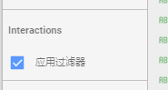

在各个步骤的报表中，则要根据url，显示对应的页面：

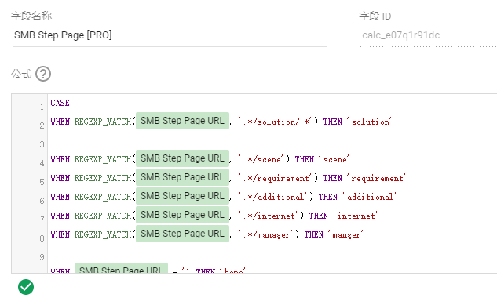

【**一个值得记录的小Tips**】同时为了保证顺序和我们系统预期一致，还需要额外建一个`指标`字段（此前的都是`维度`字段）对表格的维度进行*排序*（根据维度，如上面我们定义的SMB Step Page [PRO], 对应的值，返回不同的数字，后续即可根据这些数字实现排序）

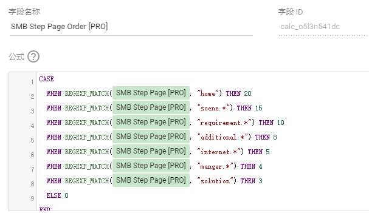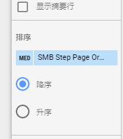

然后在添加在步骤表格中需要查看的其他指标的字段即可

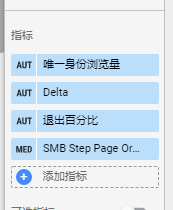