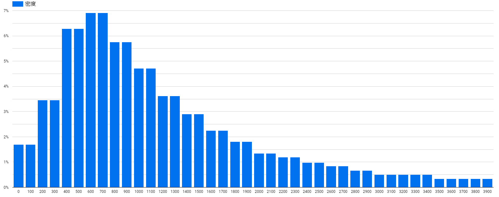
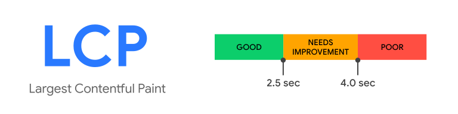
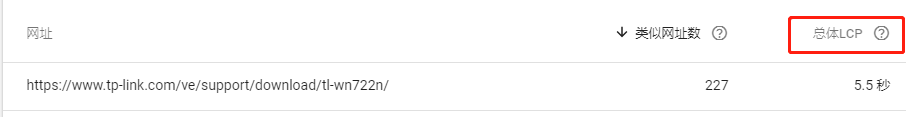

核心网页指标
---

摘要：

本文档主要介绍关于Google的`核心网页指标`的一些基本概念，并实践具体页面的优化方式

---
目录：
- [前言](#前言)
  - [核心网页指标](#核心网页指标-1)
  - [数据来源](#数据来源)
    - [PageSpeed Insights -> 获取实验室分数](#pagespeed-insights---获取实验室分数)
    - [Chrome Lighthouse 工具 -> 获取本地分数](#chrome-lighthouse-工具---获取本地分数)
    - [Google BigQuery项目 -> 获取真实的用户体验分数](#google-bigquery项目---获取真实的用户体验分数)
- [基本概念](#基本概念)
  - [LCP - Largest Contentful Paint](#lcp---largest-contentful-paint)
    - [数据来源逻辑](#数据来源逻辑)
    - [可见内容的目标元素](#可见内容的目标元素)
    - [可见内容的大小衡量](#可见内容的大小衡量)
    - [测量方式](#测量方式)
    - [优化方向](#优化方向)
  - [FID - First Input Delay](#fid---first-input-delay)
    - [关注的交互事件](#关注的交互事件)
    - [测量方式](#测量方式-1)
    - [优化方向](#优化方向-1)
  - [CLS - Cumulative Layout Shift](#cls---cumulative-layout-shift)
    - [关注的位移情况](#关注的位移情况)
    - [布局位移分数](#布局位移分数)
    - [避免布局位移](#避免布局位移)
    - [测量方式](#测量方式-2)
  - [补充概念](#补充概念)
- [实践页面](#实践页面)
  - [LCP 优化](#lcp-优化)
    - [使用PageSpeed Insights工具测试](#使用pagespeed-insights工具测试)
    - [查看页面的最大内容元素](#查看页面的最大内容元素)
    - [优化尝试](#优化尝试)
    - [优化总结](#优化总结)
    - [其他优化方向](#其他优化方向)
  - [CLS优化](#cls优化)
    - [使用测试工具确认](#使用测试工具确认)
    - [本地debug](#本地debug)
    - [本地优化](#本地优化)
    - [其他优化方向](#其他优化方向-1)
- [附录](#附录)
  - [交互对LCP数值的影响](#交互对lcp数值的影响)
- [参考文档](#参考文档)

---
# 前言


## 核心网页指标
[核心网页指标](https://support.google.com/webmasters/answer/9205520?hl=zh-Hans)是在谷歌站长工具中的一项指标，会根据**用户实际使用情况**显示网页的性能；

报告基于以下三个指标：[LCP](#lcp---largest-contentful-paint)、[FID](#fid---first-input-delay) 和 [CLS](#cls---cumulative-layout-shift), 需要注意的是报告内的网址并不一定包含所有网址：

- 如果某网址的上述`任一指标的报告数据量`(收集的数据量)低于下限，网址会被直接忽略。

- 一旦某个网址的`所有指标的数据量`均达到阈值，网页状态即为其`最差指标`(三个指标中的最差指标)的状态。

## 数据来源
核心网页指标的数据来自 [CrUX 报告](https://developers.google.com/web/tools/chrome-user-experience-report/)(Chrome User Experience Report)。CrUX 报告会从访问您网址的实际用户那里收集有关性能的匿名指标（称为“实测数据”）。无论网址是否属于 Search Console 资源，CrUX 数据库都会收集有关该网址的信息。

结果数据可通过以下方式获得：

### [PageSpeed Insights](https://developers.google.com/speed/pagespeed/insights/) -> 获取实验室分数
它为Google网络搜寻器已知的流行URL提供URL级用户体验指标。


### [Chrome Lighthouse 工具](https://developers.google.com/web/tools/lighthouse/) -> 获取本地分数
集成在Chrome浏览器中的开发工具，可以在本地模拟得到页面性能分数。
 

### [Google BigQuery项目](https://console.cloud.google.com/bigquery?utm_source=bqui&utm_medium=link&utm_campaign=classic) -> 获取真实的用户体验分数
[BigQuery](https://cloud.google.com/bigquery/docs?hl=zh_CN) 是 Google 推出的完全托管式低成本分析数据仓库，可支持 PB 级数据规模。

谷歌收集的用户体验报告数据存放在该项服务下，它按来源汇总了Google网络抓取工具已知的所有来源的用户体验指标，并划分为多个维度。

- BigQuery项目查询部分免费，但是API功能收费，具体参考[收费标准](https://cloud.google.com/bigquery/pricing)；我们可以只使用控制台进行免费的查看（每月前 1 TB 免费）；

- 如何通过BigQuery查看网站的指标，可以参考[文档](https://developers.google.com/web/tools/chrome-user-experience-report/bigquery/getting-started?hl=zh_CN#example-queries)
  - 在[BigQuery的控制台](https://console.cloud.google.com/bigquery?project=chrome-ux-report&page=table&t=201808&d=all&p=chrome-ux-report&redirect_from_classic=true)，可以通过sql语句进行查看
  - 如果提示没有权限，请在左上角新建项目后进入创建的项目下再查看

- `BigQuery`查询样例

  查询Tapo官网2020年7月用户的FCP数据
  - 查询语句：
    ```sql
    #standardSQL
    SELECT
        bin.start,
        SUM(bin.density) AS density
    FROM
        `chrome-ux-report.all.202007`,
        UNNEST(first_contentful_paint.histogram.bin) AS bin
    WHERE
        origin = 'https://www.tapo.com'
    GROUP BY
        bin.start
    ORDER BY
        bin.start
    ```
  - 查询结果：

    

  - 使用[google data studio](https://datastudio.google.com/)显示上面存储的Big Query结果

    

<div style="clear:both;"></div>

---


# 基本概念


## [LCP - Largest Contentful Paint](https://web.dev/lcp/)

最大内容渲染时间，从用户请求网址到在视口中渲染`最大可见内容元素`所需的时间。

### 数据来源逻辑
  > To handle this potential for change, the browser dispatches a **PerformanceEntry** of type `largest-contentful-paint` identifying the largest contentful element as soon as the browser has painted the first frame. But then, after rendering subsequent frames, it will dispatch another **PerformanceEntry** any time the largest contentful element changes.
  - 浏览器在绘制第一帧的时候同时生成一个`PerformanceEntry`对象，用于记录最大内容渲染时间，对象的`element`属性指向对应的最大内容DOM结构
  - 之后在每次最大内容元素改变的时候再次生成`PerformanceEntry`
  - 通过`PerformanceEntry`对象完成最大内容渲染时间的报告
  - 注意：
    > 由于用户可以在背景标签中打开页面，因此，只有当用户将标签聚焦后，最大的内容绘画才会出现，这可能比他们第一次加载时要晚得多

### 可见内容的目标元素
LCP并不收集所有的DOM元素类型，仅对下列几种元素的渲染时间做考虑：
  - ``
  - `<svg>` 内部的 `<image>`
  - 使用了poster属性的`<video>`
  - 使用`background: url()`读取图片的元素
  - 含其他文本(节点)的块级元素
  - 变化的情况：
    - 未加载的元素被视为`未渲染`，等加载完成后才被考虑
    - 后续新增加的DOM也会被考虑
    - 删除的元素不再被考虑(*将来可能被视为候补*)
    - 元素的资源改变，则元素被停止考虑，直到加载完新的资源
    - 一旦用户进行了页面交互，则停止报告新项目

### 可见内容的大小衡量
可见内容的大小判断：
  - 最大内容渲染考虑的元素大小是指在用户的`视口内可见的大小`，如果元素(包含不可见部分)溢出窗口，则这些溢出的部分不会被考虑为元素的大小

  - 对于图像，可能经过拉伸，因此报告的尺寸以较小的为准（显示的图像缩小了，以显示尺寸为准；放大了，以原始尺寸为准）

  - 文本元素仅考虑节点大小(包含所有文本节点的最小矩形)

  - 所有元素都不考虑通过CSS应用的任何边距，填充或边框
  - 为了使计算和分派新性能条目的性能开销保持较低，对元素大小或位置的更改不会生成新的LCP候选对象。仅考虑元素的初始大小和在视口中的位置。

### 测量方式
  - 可以通过开发者工具的`Performance`功能查看
  

报告中显示的汇总 LCP 是指网址群组中某个网址在其 75% 的访问事件中达到 LCP 状态所用的时间

  

### 优化方向
  - 服务器响应时间
  - 渲染阻止的JavaScript和CSS
  - 资源加载时间
  - 客户端渲染


## [FID - First Input Delay](https://web.dev/fid/)

首次输入延迟，衡量的是从用户首次与页面进行交互（即单击链接，点击按钮或使用自定义的JavaScript驱动的控件）到浏览器实际开始处理事件处理程序的时间。

需要注意的是：
- FID`仅测量事件处理中的“延迟”`。它不测量事件处理时间本身，也不测量运行事件处理程序后浏览器更新UI所花费的时间。也就是说FID仅测量用户点击到js开始执行的这段时长；
  - 如下图，用户在页面主线程执行的时候进行了交互，将导致交互相应需要等待主线程任务结束才能执行，这段时间就是FID.
  

### 关注的交互事件
- FID是一种度量页面加载过程中响应度的指标。因此，它仅关注`离散事件`（例如单击，轻击和按键）的输入事件。
- 其他交互（例如滚动和缩放）是`连续`的动作，并且具有完全不同的性能约束（而且，浏览器通常能够通过在单独的线程上运行它们来隐藏其延迟）。

### 测量方式
- FID需要真正的用户，因此无法在通过测试工具测试。可以通过测量TBT(总阻塞时间)来侧面得到FID的情况
  - 可以在[web.dev](https://web.dev/measure/)中测试得到
    

### 优化方向
- 减少第三方代码的影响
- 减少JavaScript执行时间
- 最小化主线程工作
- 保持低请求数量和小传输大小

## [CLS - Cumulative Layout Shift](https://web.dev/cls/)

累积布局位移，会测量页面`整个生命周期`中发生的`每个`*意外布局转移*的所有单独*布局转移分数*的总和。

### 关注的位移情况
- 在视口中可见的元素在`两帧之间`更改其初始位置时，都会报告条目。这些元素被认为是**不稳定元素**。
- 仅当现有元素更改其起始位置时才会发生布局转换
  - 如果将`新元素添加到DOM`或现有元素`更改了大小`，则只要更改`不会导致其他可见元素更改其开始位置`，该元素就不会算作布局偏移

### 布局位移分数
该分数只计算`不稳定的元素`的对应分数。以下几种情况不做考虑：
1. 新增的DOM元素（没有初始位置，不是`不稳定的元素`）
2. 初始位置不变化（即便大小改变）（不是`不稳定的元素`）
3. 在`用户输入的500毫秒内`发生的版式转换（会有`hadRecentInput`标志，不计入计算中）-> 即是说用户交互500ms内引起的版式转换不会计入布局位移

### 避免布局位移
- 动画和过渡效果
- CSS `transform` 可以设置动画，而不会触发布局转换：
  - 而不是更改height和width属性，请使用`transform: scale()`。
  - 左右移动的元件，避免改变`top，right，bottom，或 left属性`，并使用`transform: translate()`来代替。

```
布局位移分数 = 总影响分数 * 总距离分数
```
- 影响分数
  
  **不稳定元素**在前一帧与当前帧的可见区域的并集区域占整个视口的比例即是`影响分数`

- 距离分数
  
  **不稳定元素**在一帧内移动的最大距离占视口面积的比例即是`距离分数`

- 例子：
  
  - 如上图，元素在前一帧占视口面积的50%，当前帧下移了视口25%的面积，二者共同面积占视口75%，因此`影响分数`为0.75
  - 元素在一帧内移动的距离是整个视口的0.25，因此`距离分数`为0.25
  - 所以`布局位移分数`为`0.75 * 0.25 = 0.1875`

### 测量方式
- 可以通过[PageSpeed Insights](https://developers.google.com/speed/pagespeed/insights/)工具进行页面测试，即可获得对应的CLS数据
  
  此前的`FID`、`LCP`也可通过该方式获取分数

- 具体的页面布局位移情况可以通过`Performance`标签下的`Experience`条目查看
  


## 补充概念
- [FCP - First Contentful Paint](https://web.dev/fcp/) 首次内容渲染

- [TTI - Time to Interactive](https://web.dev/tti/) 互动时间

- [RAIL Model](https://web.dev/rail/) 性能模型
  - Response
  - Animation
  - Idle
  - Load

- [TBT - Total Blocking Time](https://web.dev/tbt/) 总阻塞时长


# 实践页面

## LCP 优化
针对控制台给出的页面：https://www.tp-link.com/ve/support/download/tl-wn722n/ 进行优化（以桌面为例）

需要注意的是：`LCP记录在用户进行了任意交互之后就不再报告`；因此在测试的时候，为了获取最坏情况的数值，在测量结束前不对页面进行交互


### 使用PageSpeed Insights工具测试
通过[PageSpeed Insights](https://developers.google.com/speed/pagespeed/insights/)测试页面，点击左上角的`桌面`按钮获取桌面端的分数情况


### 查看页面的最大内容元素
通过Chrome的dev tools可以查看页面的LCP是哪一个元素，在何时报告的

- 在本地开发环境下，为了更清晰看到各帧之间的变化，将`Network`和`CPU`性能都调到最低

- 在优化前为`9772.6ms`，最大内容的元素为`.nav-tabs`
  - 为了方便对比，使用reload之后的时间戳作为LCP时长，实际的LCP时长是该时间戳减去报告的开始时间,可以以lighthouse下测得的LCP与`View Trace`查看到的LCP时间戳做对比获取
- 观察LCP报告的时间点前后的图片帧，可以看到`.nav-tabs`是在多个导航元素出现的时间点报告为最大元素
  - 因此目标是减少`.nav-tabs`在出现之前的耗时

### 优化尝试
快速获取页面的优化的建议，可以通过使用lighthouse工具进行测试
- 由于本地环境下的部分资源获取速度与线上环境不一致，我们测量的是线上环境的页面，这才是用户真实体验的页面
- 同时由于我们仅需要优化页面速度，所以勾选`Performance`以及`DeskTop`获取页面测试结果
  

测试结果如下：
 

- 优化建议：
  - `Preload key requests`
    
    
    直接在`common-meta`的头部加上字体的preload标签
    ```html
    <link rel="preload" href="/assets/fonts/aktivgrotesk-bold/AktivGrotesk_W_Bd.woff" as="font">
    <link rel="preload" href="/assets/fonts/aktivgrotesk-light/AktivGrotesk_W_Lt.woff" as="font">
    ```
  - `Eliminate render-blocking resources`
    
    
    参考Google 文档的[部分优化建议](https://developers.google.com/web/tools/chrome-devtools/speed/get-started#render)
    - 使用`Ctrl+Shift+P`唤出命令行
    - 搜索`Coverage`，点击`Show Coverage`
    - 点击下方的reload按钮
    
    - 等待页面完成刷新后，点击Stop按钮
    
      - 在覆盖率报告中能够看到各个资源在页面中的实际使用情况
      - 以`main.css`为例，在该页面中有`98.2%`的部分未被使用到
    - 逐项分析，将无用字节数较多的资源进行阻塞测试，看页面是否正常
      - `Ctrl+Shift+P`唤出命令行
      - 搜索`block`，点击`Show Request blocking`
      - 添加无用字节数较多的资源
        
      - 刷新页面后查看页面是否正常
    - 排查结果发现**去掉main.css之后页面样式依旧正常**
    - 同时还发现在`static.tp-link.com`域名下的资源没有**开启Gzip压缩**，同样是一个优化点
      
  - `Remove Unused CSS`
    
    - 该点的优化与上一点是一致的，但是尝试阻塞`support.css`或者`common.css`均会造成页面错乱
  - `Remove Unused JS`
    
    - 该点优化与第二点一致，但是阻塞任意的js资源均会导致逻辑报错

### 优化总结
因此目前可优化点一共有三点：
- ~~为字体添加preload标签~~
  - 在本地环境下添加后测试结果如下：
    
  - LCP的时间反而延后到`12989.9ms`
  - 对比改动前后的`Network`性能,发现原本字体的加载是在LCP报告之后，通过preload标签反而将字体的加载提前，导致LCP延后，造成反向优化，因此该项暂时不做处理
  
- 移除`main.css`
  - 在本地环境下去掉main.css资源之后，结果如下：
    
    - LCP时间提前到了`8131.1ms`，相对原来的`9772.6ms`，提升了1s多，是最大的优化点

- 开启`static.tp-link.com`的Gzip压缩

### 其他优化方向
可以参考[文档](https://web.dev/optimize-lcp/)

## CLS优化
针对控制台给出的样例`https://www.tp-link.com/cz/support/download/tl-wn722n/`（桌面端），进行优化尝试

需要注意的是：CLS记录的是在整个`生命周期`中的布局位移，可能lighthouse测试途中没有触发布局位移，但是在用户交互的时候触发了


### 使用测试工具确认
通过chrome开发工具lighthouse确认目前的页面情况


### 本地debug
- 不通过lighthouse 的`View Trace`查看（lighthouse下的`View Trace`看到的Layout Shift数据分数与LH测得分数不一致）；因此使用浏览器的Performance工具  进行查看（不需要限制`Network和CPU`,等待自然结束）
   
  - 点击`Experience`条目，下方的EventLog将会显示所有的布局位移事件
    - 大量文本节点出现布局位移
    - 导航数量骤减导致的部分元素被识别为布局位移
    - 顶部出现的cookie确认弹窗下移了整个页面
    - chrome的工具在定位iframe下的元素出现了问题，通过展开子项，对比宽高找到了在`布局位移`中实际对应的元素，在livechat中iframe下的元素也被识别为布局位移
    - **在多次测试下，发现`CLS`位移具体信息不稳定，稳定出现较多的是`livechat`插件中iframe元素下导致的布局位移较多

### 本地优化
- ~~优化文本字体读取导致的位移，参考[文档](https://web.dev/preload-optional-fonts/)~~
  - ~~在头部添加字体的预加载~~
    ```html
    <link rel="preload" href="/assets/fonts/aktivgrotesk-bold/AktivGrotesk_W_Bd.woff" as="font">
    <link rel="preload" href="/assets/fonts/aktivgrotesk-light/AktivGrotesk_W_Lt.woff" as="font">
    <link rel="preload" href="/assets/fonts/aktivgrotesk-light/AktivGrotesk_W_Lt.woff" as="font">
    ```
    - -> 优化结果：lighthouse关于CLS分数为`0.107`, 效果不明显，同时LCP时间被拉长为`2.0s`，因此该项优化不进行
  - ~~修改字体`font-display`由`swap`为`optional`~~
    - `swap`意味着浏览器会一直等待字体资源的下载，下载完成后直接替换先显示的本地字体
    - `optional`意味着浏览器有很短暂的阻塞时间(字体空白，100ms或更少)，在这段时间内读取到字体则使用新字体，否则不再使用新字体
    - -> 优化结果：lighthouse关于CLS分数为`0.107`,效果不明显
- 优化由于导航数量的骤减导致的布局位移
  - 将`.nav-tabs`下的`<li>`元素，每个都加上`if`判断是否渲染，对于`softwares`和`others`的循环渲染部分，切换循环的变量与content一致，避免渲染无用导航
    - `$softwaresArr` -> `$softwares`，同时显示的导航名修改为`$softwareArr[$key]["cname"]`
    - `$othersArr` -> `$others`，同时显示的导航名修改为`$othersArr[$otherKey]["cname"]`
    - -> 优化结果：lighthouse关于CLS分数为`0.049`，效果明显
- ~~优化cookie弹窗导致的页面位移~~
  - 如果要进行该项优化，需要将js逻辑修改到php进行服务端渲染，但因此无法判断客户端接受cookie的情况，因此该项优化考虑将cookie的布局改为fixed或者进行样式的调整
  - 该项调整待定，个人建议可以修改为fixed布局放到body元素底部，避免布局位移
- ~~优化livechat组件下iframe内的元素位移~~
  - 由于该部分组件内部采用iframe实现，无法进行调整，解决方案待定

### 其他优化方向
可以参考[文档](https://web.dev/optimize-cls/)


# 附录
## 交互对LCP数值的影响
测试页面：https://www.tp-link.com/en/
- 进行了交互(滚动，点击)的TP首页
  - LCP时间 - 1081.4ms
  - LCP元素是加载中的图片元素
  
- 不进行交互的TP首页 
  - LCP时间29171.2ms
  - LCP元素为第一个banner下的h2元素（其他banner的img元素没有显示，第一个banner的背景又是iframe，因此没有被记录为LCP考虑的元素）
  

由此可见，在交互的时候回中止LCP的报告，因此测试LCP的时候不能进行页面交互，会导致错误的LCP数据


# 参考文档
- [LCP](https://web.dev/lcp/)
- [FID](https://web.dev/fid/)
- [CLS](https://web.dev/cls/)
- [Controlling Font Performance with font-display](https://developers.google.com/web/updates/2016/02/font-display)
- [Performance Analysis Reference](https://developers.google.com/web/tools/chrome-devtools/evaluate-performance/reference)
- [Dev Tools](https://developers.google.com/web/tools/chrome-devtools/?utm_source=devtools)
- [PageSpeed Insights](https://developers.google.com/speed/pagespeed/insights/)