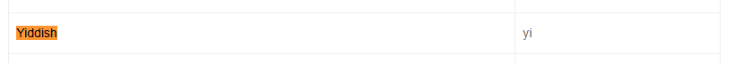

核心网页指标二期
===
摘要：

  此前在download 页面进行的初步CLS优化的提高并不明显, 即日起从其他方面入手提高页面的CLS指标

---
目录：

- [核心网页指标二期](#核心网页指标二期)
  - [目前情况](#目前情况)
  - [优化实践](#优化实践)
    - [字体](#字体)
  - [下期优化安排](#下期优化安排)
    - [官网字体优化](#官网字体优化)
    - [Cookie的弹窗逻辑优化](#cookie的弹窗逻辑优化)
  - [参考](#参考)

---

## 目前情况
在download页面进行的导航部分的CLS优化效果改善并不明显，分数没有变化，因此本次优化尝试从其他角度入手


## 优化实践
### 字体
- 情况说明：
  由于字体的加载导致的页面出现布局位移的情况比较明显，在download页面请求了8次字体资源
   
  除了youtube视频请求的三个相同字体资源，在页面上一共请求5次不同的字体资源，单个字体资源字体平均140KB，用户加载速度慢的时候，将会明显看到由于字体变化导致的布局位移

- 优化过程：
  - ~~针对第三方font-awesome的优化，对于字体`fa-solid-900.woff2`~~
    - 在coverage中没有找到对应的css应用情况
    
    - 溯源后发现是第三方工具的依赖，暂时不作处理
    
  - 针对TP默认字体的优化
    - 在CSS层面优先调用体积更小的`woff2`(不影响ie使用`eot`格式字体)
      
      将单个字体文件的体积从`150K -> 120K`
    - ~~去除使用情况较少的font-weight字体~~
      - 使用的地方都比较分散同时对视觉效果影响较大，不考虑此项优化

    - 使用字体的子集字体文件，减少不同语种读取字体文件的体积，避免无用字体导致读取加载慢，进行不同语种`[lang]`下不同的`font-family`读取
      - 使用在线工具[wakamaifondue](https://wakamaifondue.com/)查看字体文件内容，发现存在54中字体语言(*仅供参考*)
        - 
      - 在目前的字体归档目录下有发现字体的子集目录，同为版权方提供的字体文件
        - 使用wakamaifondue查看字体内容，以Arbc下的子集字体为例，发现字体包内包含的语种减少为28个(*仅供参考*)
          - 
      - ~~使用线上的子集生成器https://everythingfonts.com/subsetter~~ 
        - =>由于版权问题不得修改字体文件，因此使用提供的subset字体文件
      - 方案尝试：
        - ~~直接针对每个子集字体单独定义@font-face，然后在`<body>`的`font-family`下优先调用子集字体~~
          ```css
          body {font:300 13px/1.6 AktivGrotesk-Arabic,AktivGrotesk,Helvetica,sans-serif;}
          ```
          => 对于站点内字符都在子集内的情况，能够达到理想效果
             
          => 对于子集字体没有的字符，会再次请求后面的字体文件，导致多次请求，造成更差的体验
             
        - ~~使用`unicode-range`~~
          - `unicode-range`是在限定字符出现的时候才请求字体文件(设置于`@font-face{}`中，一般设置为字体文件内的部分字符集)，而浏览器`font-family`默认行为就是首个字体内不包含指定字符的时候就请求使用后续的字体(实际效果与第一点相同)
            - => 可以认为，默认的unicode-range就是字体文件含有的所有unicode-range, 因此在我们的子集字体中没有实际使用价值
        - 经过测试，发现subset下的Corp子集字体能够适用于大部分的子站点，借助[在线工具](https://fontdrop.info/), 可以查看改字体对于几个语种的具体支持情况
          - 
          - (不支持的语种会无法显示字符，出现小数点)检测后发现，Corp的子集字体能够支持
            - Cyrilic 西里尔语(俄语)
            - Greek 希腊语
            - Latin 拉丁语(英语)
            - Vietnames 越南语
          - 不支持`Arabic`, `Hebrew`, `Hindi`
          - 实际站点测试
            - 借助在线工具[unicode-table](https://unicode-table.com/en/#cyrillic), 可以找到各文字在世界的语言中使用情况
            - 查找[对应表](https://geoffkenyon.com/google-iso-country-language-codes-international-seo/)，可以找到对应语言使用的iso代码，进行站点查找
              
            - 在CMS下查找对应国家站点信息，本地在font-family前面加上Corp子集字体，进行子站点访问各页面，测试看是否能够覆盖页面所有字符 => 即不会请求原来的字体
            - 测试结果：
              - Cyrilic文字使用的语种，主要是俄语等`0400-04FF`
                
                - RU/UK-UA/BG-BG:
                  - 在部分专题页面出现请求了旧字体的情况, 经和barret确认是旧专题的样式调用`font-family`使用了main.css内的旧字体，后续进行字体优化，确认专题部分去除原有字体也无问题之后做批量处理
                    

              - Greek文字使用的语种主要是希腊语，国家是希腊`0370-03FF`
                
                - GR:
                  - 支持，页面文案正常

              - Latin拉丁文，基本的拉丁文字，在英语、德语、法语、意大利语、波兰语均有使用`0000-007F`
                
                - EN\DE\FR\IT\PL:
                  - 支持，页面文案正常

              - Vietnames越南文，经确认使用了latin语的超集，主要使用在越南国家`1E00-1EFF`
                
                - VN:
                  - 支持，页面文案正常

              - Arabic 阿拉伯文，使用的语种有arabic, persian, kurd(阿拉伯语, 波斯语, 库尔德语)，使用国家集中在埃及`0600-06FF`
                
                - 通过查找[iso对应的语种表](https://geoffkenyon.com/google-iso-country-language-codes-international-seo/), 可以找到Arabic对应的iso代码为`ar`
                - 
                - 在cms站点中找到lang（组成为`语言ISO [- 区域ISO(可选)]`）为ar开头的站点，为埃及/eg/
                - EG: 不支持，需要使用Arabic子集字体

              - Hebrew 希伯来文, 使用的语种有hebrew, yiddish(希伯来语, 依地语)`0590-05FF`
                - 
                - 
                - 
                - 经确认(`lang`开头为he/yi的子站点只有已经关闭的以色列站点`/he-il/`)目前TP的希伯来语使用的国家有以色列(已关闭)

              - Hindi 经确认是梵文(Deva)，使用的语种有：sanskrit, hindi，查看目前的站点，没有发现使用梵文的国家(没有`lang`开头为`sa`, `hi`的国家)`0900-097F`
                - 
                - 
                
        - 查看了目前的站点信息表，目前publish的国家除了en站点外都有hreflang(没有hreflang的站点均为hide)，因此通过将hreflang赋值给`html`标签的`lang`属性进行语言选择，默认使用Corp字体，对于Corp字体不支持的Arabic, Hebrew使用其他子集字体（目前没有站点使用Hindi梵文字体，暂时不作添加）
          ```css
          /* default font using corp */
          body{font:300 13px/1.6 AktivGrotesk-Corp,Helvetica,sans-serif;-webkit-text-stroke:1px rgba(0,0,0,0);background:#fff;-webkit-tap-highlight-color:transparent;-webkit-text-size-adjust:none;}
          /* which corp not support: arabic, using at Arabic=>ar, persian=>FA, kurdish=>ku */
          [lang|=ar] body, [lang|=fa] body, [lang|=ku] {font-family: AktivGrotesk-Arabic,Helvetica,sans-serif;} 
          /* which corp not support: hebrew, using at hebrew=>he, yiddish=>yi */
          [lang|=he] body, [lang|=yi] {font-family: AktivGrotesk-Hebrew,Helvetica,sans-serif;}
          ```
          同时修改各页面（FTL模板文件，phppage, productpages文件，static page数据库内容）的html标签，保证页面均有正确的lang属性之后再上线新的css内容

## 下期优化安排
### 官网字体优化
- 发现在IE下部分页面会出现字体被全部请求的问题, 需要跟进解决
  - 如：https://internal-test.tp-link.com/en/home-networking/wifi-router/ 
  
- 给旧的static page页面添加header\footer，以此增加common.js
  - 需要逐个查看记录，同时可能存在部分旧页面指定了font-family，也需要重新调整

### Cookie的弹窗逻辑优化
- 通过php的cookie字段来判断用户是否需要弹窗Cookie的确认框，将cookie窗口利用php进行生成，避免前端渲染导致的布局位移

## 参考
- https://www.darrenhuang.com/core-web-vitals-lcp-fid-cls.html
- https://stackoverflow.com/questions/49490011/how-to-use-different-font-face-for-different-languages
- https://geoffkenyon.com/google-iso-country-language-codes-international-seo/
- https://markoskon.com/creating-font-subsets/