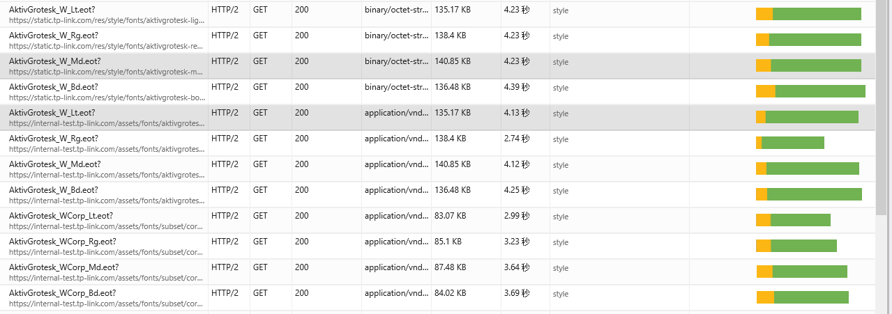
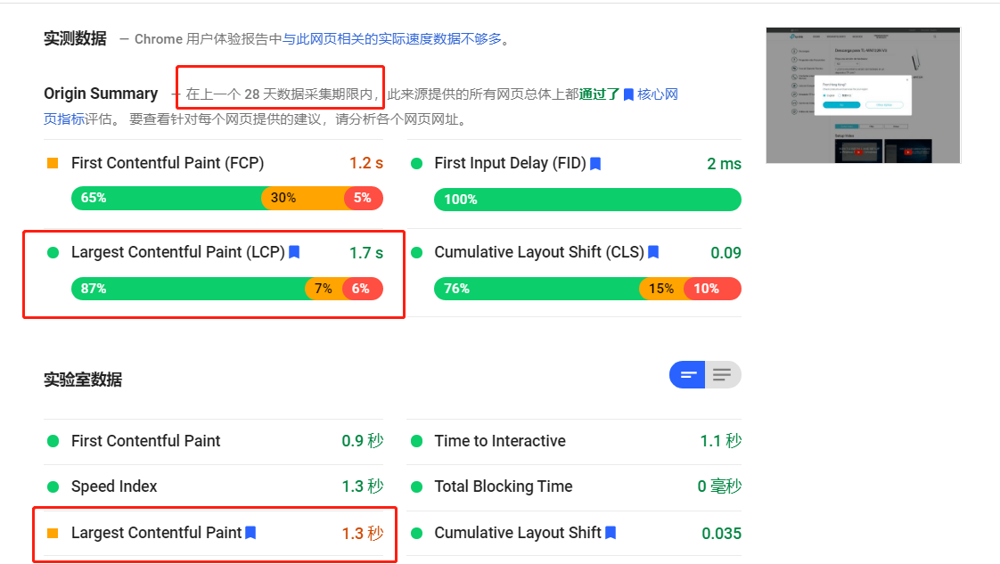
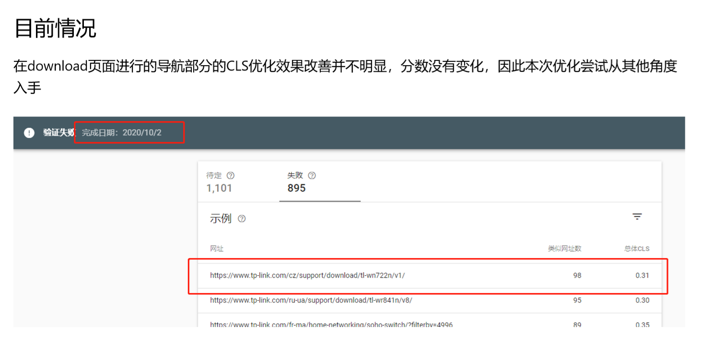
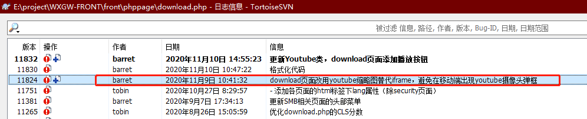
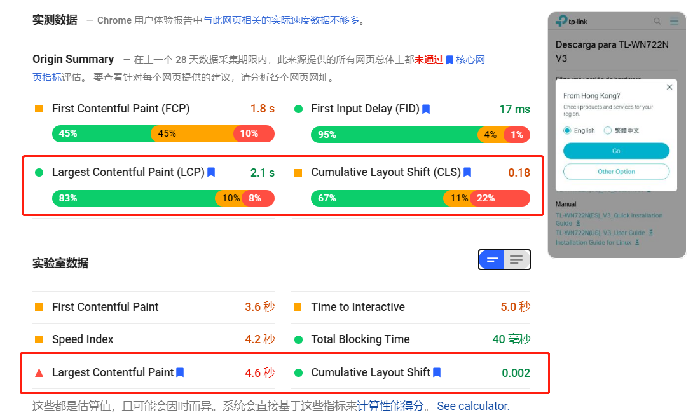

核心网页指标 -- 第四期
---
摘要：

  本文档主要记录TP字体优化方面涉及的页面以及页面性能方面的提升

---
- [优化主要流程](#优化主要流程)
  - [1. 所有页面html添加`lang`](#1-所有页面html添加lang)
  - [2. 剔除`font-family`的文件](#2-剔除font-family的文件)
  - [3. CSS改动](#3-css改动)
- [此前发现的问题的解决](#此前发现的问题的解决)
  - [IE下的产品列表出现多个字体的问题](#ie下的产品列表出现多个字体的问题)
- [优化结果与线上情况对比](#优化结果与线上情况对比)

---

# 优化主要流程
## 1. 所有页面html添加`lang`
为了让子集字体的css文件可以有效确认当前页面使用什么字体，需要为所有页面设置语言属性`<html lang="$site->hrefLang">`，主要涉及的页面有:
```
/phppage/*
/productpages/*
各个ftl文件
各个静态页面
```

## 2. 剔除`font-family`的文件
针对旧有页面，需要将原有的`font-family`多余定义去除，避免在使用优化后的子集字体之后还使用原有的字体文件，造成字体文件的二次冗余请求，主要涉及的目录有：
```
/* 主要涉及静态页面和专题页面的样式文件 */
/res/images/
/assets/images/
```
- 详细的改动记录可以在jira的备注中查看：[DOC-23](http://172.29.87.37:8081/browse/DOC-23)
- 备注：存在部分设置了`Arial`等其他字体的css，这些不作调整，因为使用的是本地字体或者特殊字体；只剔除类似如下形式的font-family：
  ```
  TP-LinkAktiv*
  AktivGrotesk*
  MyriadPro*
  ```

## 3. CSS改动
核心的样式如下：
```css
/* default font using corp */
body{font:300 13px/1.6 AktivGrotesk-Corp,Helvetica,sans-serif;-webkit-text-stroke:1px rgba(0,0,0,0);background:#fff;-webkit-tap-highlight-color:transparent;-webkit-text-size-adjust:none;}
/* which corp not support: arabic, using at Arabic=>ar, persian=>FA, kurdish=>ku */
[lang|=ar] body, [lang|=fa] body, [lang|=ku] body{font-family: AktivGrotesk-Arabic,Helvetica,sans-serif;} 
/* which corp not support: hebrew, using at hebrew=>he, yiddish=>yi */
[lang|=he] body, [lang|=yi] body{font-family: AktivGrotesk-Hebrew,Helvetica,sans-serif;}
```
- 根据html标签的`lang`属性确认使用哪个文字字体的读取

涉及改动的文件如下：
```
[Add]
/res/style/fonts/subset/                // 上传S3服务器

[Modify]
/res/style/fonts/font.css               // 含S3服务器
/res/style/css/main.css                 // 含S3服务器
/res/style/css/common.css               // 含S3服务器
/assets/css/common.css
/assets/css/common-smb.css
/common/configuration-guides/common.css
/phppage/user-guides-v2/css/font.css
```

# 此前发现的问题的解决
## IE下的产品列表出现多个字体的问题
- 此前在TP的产品列表页面在优化后出现了字体的多次请求
  

- 发现是此前在两个css文件中都对body的font-family进行了设置，其中一个css使用S3服务器的CSS，导致部分仍然使用旧字体
  - 在两个CSS文件下都对Body的font-family进行了设置，如果不一致，即使后面的css设置的font-family覆盖了前一个css文件，IE下也会对两个字体都进行请求（Chrome下则不会）
  - 目前两个CSS设置的font-family完全一致，该问题已解决

# 优化结果与线上情况对比
https://www.tp-link.com/ve/support/download/tl-wn722n/
使用工具：[PageSpeed Insights](https://developers.google.com/speed/pagespeed/insights/)
- 桌面端：
  
  - LCP和CLS与此前已采集的线上成绩来看，均有所提升
  - 同时也发现目前已有的数据的CLS表现良好，这与本课题的第二期的观测结果不一致
     
    - 查看了该页面的改动记录：
      
      应该是将youtube的视频从iframe改为图片形式带来的CLS分数提升
- 移动端：
  
  - CLS的提升明显
  - LCP的成绩反而更不好了，但是这与实际的移动端体验不符合，暂时不考虑（因为本次优化也仅针对字体，对该页面不会造成负面影响）