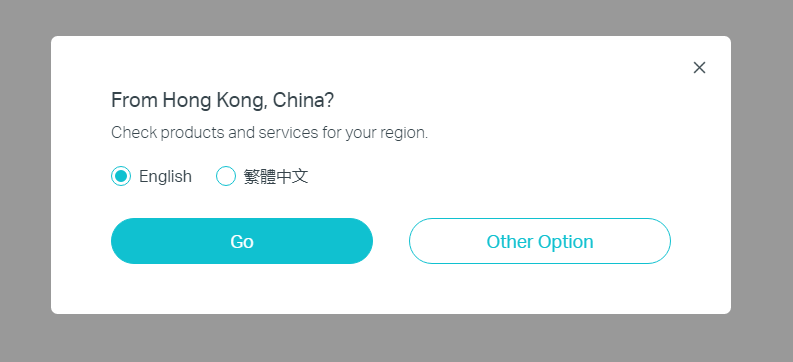
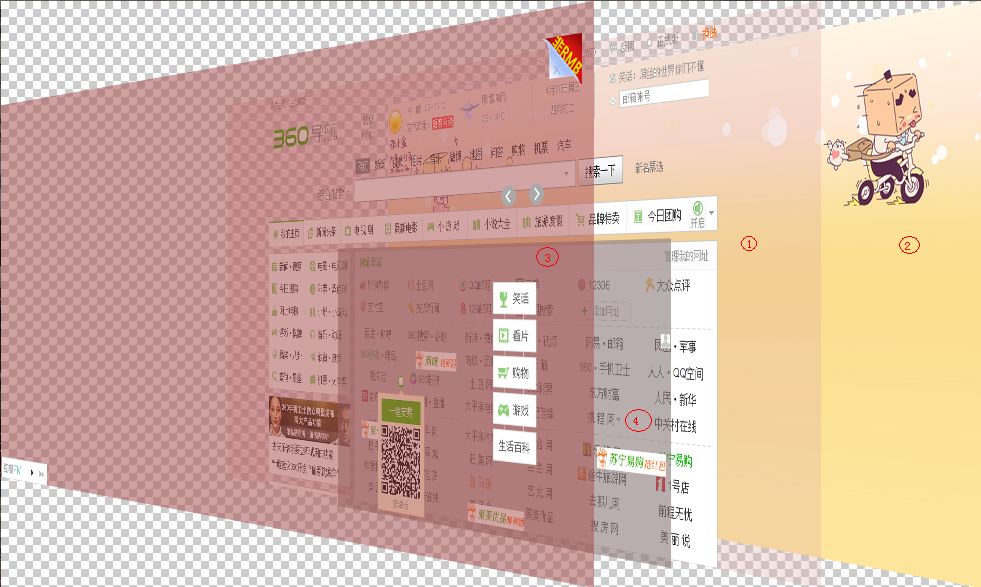

TP各个子站点浮窗登记规范
===
摘要：

  为了解决往后各个子站点可能会添加各种形式的弹窗功能，很可能会导致各种弹窗叠加在一起，因此需要一个方案进行目前线上弹窗信息的登记整合；

  本文档为浮窗重叠以及浮窗信息查询给出解决方案；

---
目录：

- [TP各个子站点浮窗登记规范](#tp各个子站点浮窗登记规范)
  - [制定该规范的目标](#制定该规范的目标)
    - [浮窗类型](#浮窗类型)
    - [浮窗位置](#浮窗位置)
    - [要解决的问题](#要解决的问题)
  - [规范方案](#规范方案)
    - [浮窗信息的规范](#浮窗信息的规范)
      - [一、 文件夹目录形式](#一-文件夹目录形式)
        - [实现方式](#实现方式)
        - [优点](#优点)
        - [缺点](#缺点)
      - [二、自动化方案](#二自动化方案)
    - [后期浮窗的规范化代码实现](#后期浮窗的规范化代码实现)
      - [基本概念](#基本概念)
      - [规范方式](#规范方式)
      - [场景处理方式](#场景处理方式)
        - [长期活动浮窗](#长期活动浮窗)
        - [GTM短期活动浮窗](#gtm短期活动浮窗)
        - [Static Page静态页面](#static-page静态页面)
        - [无静态资源的php脚本功能](#无静态资源的php脚本功能)
        - [*可交互性的非浮窗内容](#可交互性的非浮窗内容)
      - [存在问题](#存在问题)
  - [最终上线方案](#最终上线方案)
  - [参考](#参考)

---

## 制定该规范的目标
### 浮窗类型
- 短期活动弹窗（GTM）
- 长期活动弹窗（ftl）
- 静态页面（CMS: static page）
- php功能性模块（IP重定向弹窗）
- *顶部cookie确认（可交互性的非浮窗内容遮挡问题）

### 浮窗位置
- 页面的各个角落方位
  - 
- 页面遮罩弹窗
  - 

### 要解决的问题
- 弹窗的z-index信息（与页面原有fixed层）
- 知道在页面指定位置有哪些子站点有浮窗
- 静态页面下的浮窗如何知道
- GTM的浮窗如何知道
- 如果下线了如何处理

## 规范方案
方案的简易拓扑：https://www.processon.com/view/link/5a559a84e4b010a6e70deeb7
### 浮窗信息的规范
需要进行页面各个浮窗信息的获取登记，在进行新浮窗实现的时候，才能够对当前页面已经有的浮窗信息有所把握。
#### 一、 文件夹目录形式
##### 实现方式
- 在每次新建浮窗的时候就根据浮窗类型，在带有位置信息指定目录下添加对应浮窗的静态资源
  - `/assets/diff/{contry}/widgets/{position}/{created}/`
  - 比如`/assets/diff/uk/widgets/left-btn/20201113/`

- 对于php的功能模块，GTM或者其他不带有静态资源的，也建立一个对应的空文件夹，存入svn，作为查找信息

- 在浮窗下线了之后将对应的文件夹删除，同步至svn；保证最新的svn版本中只会查看到目前线上的浮窗

##### 优点
- 目录结构清晰，能够快速在目录中检索得到目前的浮窗情况

##### 缺点
- 对于没有静态资源的php功能模块（比如国家弹窗），需要额外进行手动的文件夹创建
- 下线操作需要额外的删除对应资源，同时通过svn溯源不够方便

#### 二、自动化方案
通过脚本工具，解放人工重复操作的人力消耗；
- ~~通过phpdoc 注释实现浮窗信息的登记~~
  - 尝试过使用phpdoc进行注释文档生成，但是站点php页面过多，需要遍历整个项目php，速度极慢同时会内存溢出
  - 浮窗一般添加在footer.ftl底部，会在每个站点的footer.php中都带上注释，不够简约

- 主动/函数式调用脚本以问答选项方式将浮窗信息添加到指定位置的excel文档中
  - 不必打开资源管理器，再找到excel文档操作
  - （理论上）可以配合php执行本地脚本，将脚本的执行放入php设置`$tpFixedView`变量的函数中，在测试开发阶段，只要调用了就会将对应浮窗信息登记到excel；需要在发布时候去掉对应脚本逻辑

### 后期浮窗的规范化代码实现
使用信息登记的方式进行浮窗信息查找以外，还需要规避信息登记不及时可能导致的问题

- 这个可以通过规范的项目工程化来避免额外的人工记录；

- 首先需要对浮窗会有的z-index进行规范处理，避免浮窗层叠顺序的混乱

#### 基本概念
- z-index的数值是在一个层叠上下文中单独维护
- 360的页面实现方式是通过将各个层级的元素单独放到三个设置好z-index的relative父级元素(3个独立的层叠上下文)中实现分层，这样内部的z-index就不会再混合到一起


#### 规范方式
参考360的解决方案，我们也可以将浮窗统一到一个层叠上下文中，就不必再考虑全局的z-index影响，也不必再考虑z-index的规范问题

使用一个单独的div元素包裹所有的浮窗元素，和原来TP官网的带有z-index的元素隔离，比如顶部导航等，避免遮挡官网重要信息

整体dom结构如下：
```html
<body>
  <div class="page-content-wrapper">
    <!-- header: z-index = 999 -->
    <div class="tp-header"></div> 
    <div class="tp-footer"></div>
    <!-- New 在footer.php中渲染 -->
    <!-- tp-fixed-view-container 建立层叠上下文，层叠顺序在header下，footer上；这样所有的子元素都会如此，也不必考虑官网的z-index -->
    <div class="tp-fixed-view-container">
      <div class="tp-fixed-view-lt">
        <div class="uk-left-btn">...</div>
      </div>
      <div class="tp-fixed-view-lm"></div>
      <div class="tp-fixed-view-lb"></div>
      <div class="tp-fixed-view-rt"></div>
      <div class="tp-fixed-view-rm"></div>
      <div class="tp-fixed-view-rb"></div>
      <div class="tp-fixed-view-m"></div>
      <div class="tp-fixed-view-t"></div>
      <div class="tp-fixed-view-b"></div>
    </div>
    <!-- [End] New -->
  </div>
</body>
```
- 可以考虑将定位css应用到`.tp-fixed-view-xx`下，将目前的官网页面固定地分成几个板块（具体哪几种板块，什么位置，则需要和策划进行确认）以后提供给需求方做选择
  - 确定了各个板块位置之后，可以对各个板块进行位置宽高的预定义，往后的活动浮窗，则相对各个位置板块进行位置定义即可
- 在`footer.php`中，新增对应浮窗的变量`$tpFixedView`，处理静态页面情况下的浮窗插入，变量结构如下：
  ```php
  $tpFixedView = [
    'lm' => [
      'dom' => '<div class="uk-betterwifiboosting">...</div>',
      'priority' => 10,
      'expire' => new DateTime() // not required
    ];
  ];
  ```
  - 在php中进行对应浮窗元素下渲染`$tpFixedView`为js的前端变量, 实现js纯前端和php渲染的统一处理
    - footer.ftl 在活动浮窗添加之后的末尾
    ```php 
      <script>
        tp.fixedView = tp.fixedView || {};
        var extraPHPFixedView = <?=json_encode($phrases, JSON_UNESCAPED_UNICODE)?>;
        for (var pos in extraPHPFixedView) {
          tp.fixedView[pos] = tp.fixedView[pos] || {}
          // 已有浮窗优先级低于php添加的浮窗
          if (typeof tp.fixedView[pos].priority === 'undefined' || tp.fixedView[pos].priority < extraPHPFixedView[pos].priority) {
            tp.fixedView[pos] = extraPHPFixedView[pos];
          }
        }
      </script>
    ```
- 前端js异步插入的浮窗，则通过将所有的script脚本放入全局变量`tp.fixedView`对象中, 根据优先级替换原有位置的浮窗, 如下进行同步引用：
  ```html
  <script>
    function updateFixedView(position, dom, priority) {
      // 判断是否是合法的浮窗位置
      var validPosition = []
      $('.tp-fixed-view-container').children().each(function() {
        var matchedPos = $(this)[0].className.match(/tp-fixed-view-(\S*)/)
        if (matchedPos.length > 1) validPosition.push(matchedPos[1])
      })
      if (validPosition.indexOf(position) < 0) return
      tp.fixedView = tp.fixedView || {}
      var currentView = {
        dom: dom,
        priority: priority
      }
      // 已有浮窗优先级低于添加的浮窗
      if (!tp.fixedView[position] || (tp.fixedView[position] && tp.fixedView[position].priority < currentView.priority)) {
        tp.fixedView[position] = currentView
      }
    }
    updateFixedView('lt', '<script src="..."></script>', 10)
  </script>
  ```
  - 约定统一放入全局的`.tp-fixed-view-xx`元素下，根据不同的位置放入不同的元素下
  - 在document完成全部加载的时候, 根据全局的浮窗变量进行各个位置的浮窗渲染
    - 考虑到GTM会异步方式进行浮窗渲染，因此判断页面是否会有gtag相关资源决定是否需要渲染
      - 无GTM的js请求，则将浮窗渲染代码直接执行
      - 有GTM资源，由于将渲染代码已经放入GTM设置优先级，因此不必执行
      ```js
      if (tp.fixedView) {
        $(function() {
          for (var i in tp.fixedView) {
            $('.tp-fixed-view-' + i).append(tp.fixedView[i].dom)
          }
        })
      }
      ```

#### 场景处理方式

##### 长期活动浮窗
- 一般长期活动浮窗widget通过插入js中的全局浮窗变量，在根据不同的位置放入不同的字段下

- 如果浮窗变量中对应位置已经有元素了，则根据需求决定是否插入，设置对应的优先级
  - 可能会有一个位置有多个浮窗的需求
  - 可能部分旧页面要替换，部分旧页面不替换，可以调整旧页面下的priority实现需求

##### GTM短期活动浮窗
- 原本没有强制规定输入内容，也可以输入dom结构作为浮窗；为了在统一的dom结构中管理，现在改为：
  - 与长期活动浮窗widget脚本动态插入方式一致，使用js修改全局变量`tp.fixedView`，通过GTM设置过期时间
    - 相比自行js设置过期时间会更安全（而GTM能够自动判断请求时间是否真实）；

      
    - 同时利用GTM可以设置时区，会比`php`设置更加便捷（需要在每次调用时间函数时候进行时区的设置） => 不过也可以进行php函数的封装实现）
      - 参考barret原来的过期逻辑中进行微调，服务器中php.ini需要将时区校对到服务器所在时区
        - https://www.php.net/manual/zh/datetime.construct.php
        - https://www.php.net/manual/zh/timezones.php
        ```php
          <?php $deadline = date("2020-11-07 00:00:01"); ?>
          <!-- 改为 -->
          <?php $deadline = new DateTime("2020-11-07 00:00:01", new DateTimeZone('Europe/London')); ?>
        ```
  - => 因此还是推荐将浮窗相关在ftl代码进行添加，然后将对应有过期需求的活动可以通过封装好的php函数进行调用, 大致代码如下：
    ```php
    /**
     * 进行浮窗信息添加
     */ 
    function setFixedView($fixedView) {
      $deadline = $fixedView['expire']
      if ($deadline) {
        // 可以额外封装国家到时区的信息，通过国家自动查找时区
        $outdated = strtotime(date("y-m-d h:i:s")) > strtotime($deadline);
        if ($outdated) {
          // 可以添加短语翻译
          // @todo ！！进行tp浮窗参数的添加
          return true
        } else return false
      } else {
        // @todo ！！进行tp浮窗参数的添加
      }
    }
    #[ftl] if siteId === 16
    setFixedView([
      'dom' => '<script src="..."></script>',
      'priority' => 10,
      'expire' => new DateTime('2020-11-07', new DateTimeZone('Europe/London'))
    ])
    #endif
    ```

##### Static Page静态页面
- 使用变量`$tpFixedView`进行浮窗信息的传入
  ```php
    $curFixedView = [
      'dom' => '<div class="uk-betterwifiboosting" data-data-priority="10">...</div>',
      'priority' => 10
    ];
    // 如果没有浮窗定义
    if (is_null($tpFixedView)) {
      // 定义$tpFixedView
      $tpFixedView=[
        "lm" => $curFixedView
      ];
    }
    // 如果仅当前位置没有浮窗
    else if (is_null($tpFixedView['lm'])) {
      $tpFixedView['lm'] = $curFixedView
    }
    // 如果当前位置的浮窗已经有内容了且优先级低于本次浮窗
    else if ($tpFixedView['lm'] && $tpFixedView['lm']['priority'] && $tpFixedView['lm']['priority'] < $curFixedView['priority']) {
      $tpFixedView['lm'] = $curFixedView;
    }
  ```

##### 无静态资源的php脚本功能
- 与`Static Page`一样，使用变量`$tpFixedView`进行浮窗信息的传入显示

##### *可交互性的非浮窗内容
- 非浮窗类型的可交互内容，可能在页面的各个地方显示，浮窗要根据具体情况看能否进行添加或者添加将浮窗关闭的按钮，保证用户能够进行底层内容的交互；
- *或者对于整个浮窗层提供一个切换显示的选项

#### 存在问题
- 移动端与pc端浮窗位置不一致的情况无法合理登记，需要考虑方案的拓展
- 优化：
  - 是否可以减去js的浮窗需求？
    - 全部通过php调整，可以省去前端js的动态插入过程
    - 可以通过php直接引入js文件内容到dom结构中，减少请求

## 最终上线方案
```js
/**
 * 全局浮窗管理相关回调函数
 * created 2021.02.05
 * @author tobin.xu
 * @example 
 * tp.fixedView.add({
 *  position: 'left-middle',
 *  dom: '<script src="..."></script>',
 *  priority: 10, // default 0
 *  expire: new Date('2021-5-1'),
 *  urls: [],
 *  excludeUrls: [],
 *  checkShowHandler: [],
 *  cookieName: ''
 * });
 * tp.fixedView.add({
 *  position: 'right-middle',
 *  dom: '<script src="..."></script>'
 * });
 * ...
 * tp.fixedView.show();
 */
tp.fixedView = (function() {
  var hasFixedViewShown = false; // 是否已经显示了浮窗
  // 浮窗z-index 999990, 避免遮挡dialog的999999
  var $fixedDOM = $('<div></div>').attr('id', 'tp-fixedview-container').css({
    position: 'relative',
    'z-index': 999990
  });
  /**
   * 合法的位置信息
   * key值为浮窗位置，value为当前浮窗显示时候需要对比的其他浮窗
   */ 
  var validPositionMap = {
    'left-middle': 'left-middle',
    'right-middle': 'right-middle',
    'center': 'center',
    'left-top': ['left-top', 'top'],
    'right-top': ['right-top', 'top'],
    'top': ['top', 'left-top', 'right-top'],
    'left-bottom': ['left-bottom', 'bottom'],
    'right-bottom': ['right-bottom', 'bottom'],
    'bottom': ['bottom', 'left-bottom', 'right-bottom'],
  }
  var validPositions = Object.keys(validPositionMap) // 扁平化位置信息

  var globalFixedViews = {}; // 真实浮窗信息，用于构造实际显示在页面上的内容
  var historyFixedViews = []; // 保存所有浮窗，可以查看所有add操作保存的浮窗信息
  return {
    /**
     * 添加某个浮窗到全局显示
     * @param {object} options 浮窗内容参数
     * @example options = {
     *  position: 'left-middle', // [必填]浮窗的位置
     *  dom: '<script src="..."></script>', // [必填]要显示的浮窗dom结构
     *  priority: 10, // default 0 优先级越高的会覆盖优先级低的进行显示，相同优先级后续添加的会覆盖先前添加的
     *  expire: new Date('2021-05-01'), // 过期日期
     *  urls: [], // 需要显示的页面，可以是正则或者字符串（字符串需要完全匹配），只要匹配任何一个条件即可显示
     *  excludeUrls: [], // 不需要显示的Urls数组，与checkShowHandler取交集
     *  checkShowHandler: function() {}, // 复杂的显示判断，如果要显示则返回true，否则返回false
     *  cookieName: 'uk-betterwifiboosting' // 用于判断用户是否已经关闭了该浮窗的Cookie
     * }
     */
    add: function (options) {
      options.priority = options.priority || 0;
      options.urls = options.urls || [];
      options.excludeUrls = options.excludeUrls || [];
      var position = options.position,
      priority = options.priority,
      expire = options.expire,
      cookieName = options.cookieName,
      urls = options.urls,
      excludeUrls = options.excludeUrls 
      // 使用historyFixedViews记录所有操作，方便遗留代码的删除
      historyFixedViews.push(options);
      // 判断是否存在cookieName，存在则不显示，不作处理
      if (tp.getCookie(cookieName) !== null) return;
      // 判断日期是否过期，过期不作任何处理
      if (expire && expire < new Date()) return;
      // 位置值非法，不做处理
      if (validPositions.indexOf(position) < 0) return;
      // 如果浮窗已经显示出来，则不会再显示，因此不必再进行添加
      if (hasFixedViewShown) return;
      // 检查是否符合自定义的显示判断函数
      if (options.checkShowHandler && !options.checkShowHandler()) return 
      // 判断当前页面的url路径是否符合要求
      var urlMatched = false;
      var currentURL = location.href.split('?')[0].split('#')[0]; // 移除url参数和锚点
      // 检查是否是排除的url
      for (var i = 0; i < excludeUrls.length; i++) {
        var toMatch = excludeUrls[i];
        if (toMatch instanceof RegExp && toMatch.test(currentURL)) return 1;
        if (typeof toMatch === 'string' && location.pathname === toMatch) return 2;
      }
      // 检查是否是要显示的url
      for (var i = 0; i < urls.length; i++) {
        var toMatch = urls[i];
        if (toMatch instanceof RegExp) {
          urlMatched = urlMatched || toMatch.test(currentURL);
        }
        if (typeof toMatch === 'string') {
          urlMatched = urlMatched || location.pathname === toMatch;
        }
      }
      if (urls.length === 0) urlMatched = true;
      if (!urlMatched) return ;

      var relatedPositions = validPositionMap[position];
      // 如果存在其他关联位置需要替换的时候
      if (relatedPositions instanceof Array) {
        var hasOtherHigher = false
        $.each(relatedPositions, function(index, posItem) {
          if (globalFixedViews[posItem] && globalFixedViews[posItem].priority > priority) { hasOtherHigher = true }
        })
        // 如果存在已有浮窗优先级比当前浮窗高，则不作操作
        if (hasOtherHigher) return;
        else {
          // 隐藏所有关联位置的浮窗信息
          $.each(relatedPositions, function(index, posItem) {
            delete globalFixedViews[posItem]
          })
        }
      }
      // 如果当前新增浮窗相等或高于所有关联浮窗优先级，则进行替换
      globalFixedViews[position] = globalFixedViews[position] || options;
      if (globalFixedViews[position].priority <= priority) {
        globalFixedViews[position] = options
      }
    },
    /**
     * 根据已有的globalFixedViews进行构造
     */
    show: function() { 
      // 如果没有进行过浮窗添加或者已经显示过则不作任何处理
      if (hasFixedViewShown) return;
      hasFixedViewShown = true;
      $('body').append($fixedDOM);
      for (var pos in globalFixedViews) {
        $fixedDOM.append(globalFixedViews[pos].dom);
      }
    },
    // 显示所有的add操作添加
    getHistory: function() {
      return historyFixedViews;
    },
    // 显示当前显示的浮窗信息
    getCurrent: function() {
      return globalFixedViews;
    }
  };
})();
```
## 参考
- 前端项目中有简洁的z-index的约束规则（管理方案）吗？
  - https://www.zhihu.com/question/24216418
  - https://github.com/lijinghust/lijinghust.github.com/issues/2
- 深入理解CSS中的层叠上下文和层叠顺序
  - https://www.zhangxinxu.com/wordpress/2016/01/understand-css-stacking-context-order-z-index/
- WEB三层设计结构------管理z-index的神方案
  - https://github.com/lijinghust/lijinghust.github.com/issues/2
- https://developer.mozilla.org/zh-CN/docs/Web/Guide/CSS/Understanding_z_index/The_stacking_context

- phpDOC: https://docs.phpdoc.org/3.0/guide/references/phpdoc/tags/index.html#tag-reference